# Tomodachi Studio - Stack And Implementation Map

Generated: 2026-05-20

This document is the single source-of-truth overview for what the current project uses, how the code is organized, how the pixel-art studio works internally, which visuals are included, and how the local/deployed app connects to AI, exports, security, and payments.

The project is a browser-first React/TypeScript studio for turning images, JSON files, AI sketches, and starter templates into repaintable Tomodachi Life: Living the Dream style pixel guides. The important product idea is not only "make pixels"; it is "make a grid a person can repaint square by square without guessing."

Obsidian project atlas mirror:

```text
/Users/davidortiz/Main-Learning-Vault/Neuronal-Connections/1200-PROFESSIONAL/Upwork/Active Projects/Tomodachi_Studio/Project_Implementation_Atlas.md
```

The repo document is the code-facing implementation map. The Obsidian atlas is the professional proof/project-context note for the user's vault.

## 1. Current Purpose

Tomodachi Studio currently combines four product lanes:

1. **Pixel-art repaint studio**
   - Import photos, character art, logos, memes, or JSON.
   - Convert them into a grid backed by Tomodachi palette color IDs.
   - Preview before commit.
   - Touch up with paint tools.
   - Optimize colors/noise for hand repainting.
   - Export JSON, PNG guides, palette sheets, and an HTML reference page.

2. **Tomodachi Life Mii mask workflow**
   - Face-oriented import presets.
   - Subject focus controls.
   - Background flattening.
   - 64x64, 96x96, 128x128, and 256x256 detail paths.
   - Starter canvases and character/mask templates.

3. **AI-assisted pixel sketching**
   - Local browser chat sessions.
   - OpenRouter model picker.
   - Optional current-grid summary and PNG snapshot.
   - Strict applyable sketch JSON path.
   - Palette-ID validation before an AI sketch is converted into a `GridDocument`.

4. **Public website support**
   - Home, studio, guides, FAQ, help, legal, unlock, and support pages.
   - Stripe checkout for support/recovery products.
   - Cloudflare Pages deployment with Pages Functions.
   - Security headers, robots policy, crawler controls, and Cloudflare security helper scripts.

## 2. High-Level Architecture

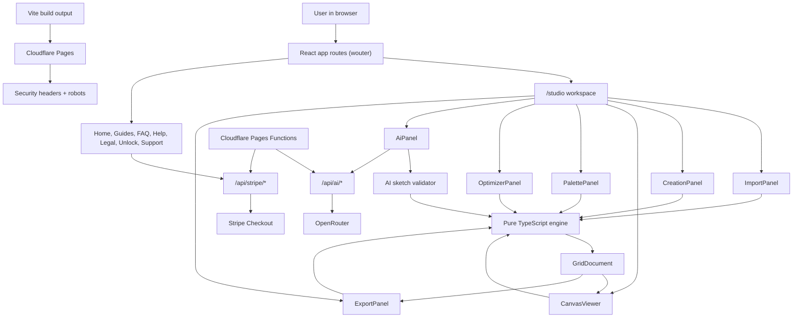

## 3. Layer Model For This Project

This is how the user's abstraction-layer thinking maps onto the actual codebase.

| Layer | What It Means Here | Concrete Project Pieces |
| --- | --- | --- |
| L0 Domain/game context | Tomodachi Life: Living the Dream workflow, Palette House repainting, Mii face masks, character/fan-art grids | Product copy, guide pages, import presets, palette naming, starter templates |
| L1 Source inputs | Raw files and source ideas | Image files, AVIF/JPG/PNG/WebP/BMP/GIF, LTG JSON, starter templates, AI chat prompts |
| L2 Core data model | The normalized repaintable representation | `GridDocument`, palette IDs, row-major `cells`, metadata, locked colors |
| L3 Engine logic | Pure transformations that do not depend on React | `grid.ts`, `image-import.ts`, `json-io.ts`, `optimizer.ts`, `canvas-renderer.ts`, `color.ts`, `palette.ts`, `templates.ts`, `ai-sketch.ts` |
| L4 UI state and interactions | How the user edits the document | `useGridDocument`, `Studio.tsx`, panels, undo/redo, preview/commit, paint tools |
| L5 Local browser persistence | State that stays in this browser only | AI chat sessions in `localStorage`, consent state, no database in V1 |
| L6 API/runtime services | Server or edge endpoints | Vite dev middleware, Express server, Cloudflare Pages Functions |
| L7 External integrations | Services outside the app | OpenRouter, Stripe, Cloudflare KV, Have I Been Pwned password range API |
| L8 Deployment/security/ops | How it runs publicly and stays controlled | Cloudflare Pages, `wrangler.toml`, `_headers`, `robots.txt`, Cloudflare Bot Management helper, Doppler-managed secrets |

## 4. Repository Layout

```text
living-the-grid-studio/
  client/
    public/
      _headers
      _redirects
      robots.txt
      sitemap.xml
      sitemap-images.xml
      manifest.webmanifest
      hero.webp
      canvas-demo.webp
      empty-state.webp
      palette-swatches.webp
      og-image.png
      icon-192.png
      icon-512.png
      icon-maskable.png
    src/
      App.tsx
      main.tsx
      index.css
      pages/
      components/
        studio/
        ui/
      hooks/
      lib/
        engine/
      contexts/
  functions/
    _middleware.ts
    api/
      ai/[[path]].ts
      stripe/[[path]].ts
      webhooks/stripe.ts
  server/
    index.ts
    openrouter.ts
    stripe.ts
  shared/
    ai.ts
    products.ts
    residents.ts
  fixtures/
    living-the-grid-real.json
    ltg-indexed-palette-sample.json
    sample-grid-document.json
    creative-templates/
  scripts/
    verify-ltg-import.ts
    verify-image-import.ts
    verify-creative-templates.ts
    verify-ai-sketch.ts
    verify-residents.ts
    verify-studio-browser.ts
    compare-openrouter-models.ts
    cloudflare-security-insights.ts
    save-creative-template-fixtures.ts
    sync-cloudflare-worker-secrets.sh
  package.json
  vite.config.ts
  tsconfig.json
  wrangler.toml
```

## 5. Main Technologies Being Used

| Area | Tooling | How It Is Used |
| --- | --- | --- |
| Language | TypeScript | Shared across client, engine, server helpers, Cloudflare Functions, and scripts |
| Frontend | React 19 | Studio UI, pages, panels, editor state display |
| Routing | `wouter` | Lightweight route map in `client/src/App.tsx` |
| Build/dev server | Vite 7 | React dev server, middleware API proxy, build output to `dist/public` |
| Styling | Tailwind CSS v4 | Global styles in `client/src/index.css`; utility styling throughout components |
| UI primitives | Radix UI family | Buttons, tabs, sliders, selects, tooltips, scroll areas, switches, checkboxes |
| Icons | `lucide-react` | Studio toolbar icons, panel actions, import/export affordances |
| Canvas | HTML Canvas 2D | Grid renderer, image sampling, PNG export, palette sheet generation |
| Image import | Browser canvas APIs | Decode images, crop/frame/focus, filter brightness/contrast/saturation, sample pixels |
| Color matching | CIELAB + CIE76 Delta E | Match source pixels to the closest Tomodachi palette color |
| State | React state + `useGridDocument` | Holds `GridDocument`, image preview, undo/redo history, stroke transactions |
| AI | OpenRouter Chat Completions | Model picker, chat, optional image snapshot, applyable sketch JSON |
| Payments | Stripe REST API | Checkout sessions and checkout verification without Stripe Node SDK |
| Edge hosting | Cloudflare Pages | Static site plus Pages Functions |
| Edge functions | Cloudflare Pages Functions | `/api/ai/*`, `/api/stripe/*`, webhook route |
| Edge cache | Cloudflare KV | OpenRouter model list cache through `EDGE_CACHE` binding |
| Security | Cloudflare + response headers | CSP, HSTS, robots, bot/crawler policies, AI crawler blocking helper |
| Secrets | Doppler / env vars | OpenRouter, Stripe, Cloudflare tokens are expected from environment, not committed |
| Verification | `pnpm verify` scripts | Type-checking and fixture-based verification |

## 6. App Entry And Routing

The app starts in `client/src/main.tsx`, then renders `client/src/App.tsx`.

`App.tsx` wraps all routes with:

- `ErrorBoundary`
- `ThemeProvider`
- keyboard skip link
- `TooltipProvider`
- `Toaster`
- `CookieConsent`

Routes are declared with `wouter`:

| Route | Component | Purpose |
| --- | --- | --- |
| `/` | `Home` | Public landing/recovery/studio hub |
| `/studio` | `Studio` | Main pixel-art editor |
| `/privacy` | `Privacy` | Legal page |
| `/terms` | `Terms` | Legal page |
| `/cookies` | `Cookies` | Cookie policy |
| `/disclosure` | `Disclosure` | Disclosure page |
| `/affiliate-disclosure` | `Disclosure` | Alias route |
| `/help` | `Help` | Recovery/help page |
| `/guides` | `Guides` | Guide content |
| `/faq` | `Faq` | FAQ |
| `/about` | `About` | About |
| `/unlock` | `Unlock` | Paid recovery/consult products |
| `/support` | `Support` | Tip/support products |
| `/donate` | `Support` | Alias route |
| `/404` | `NotFound` | Explicit 404 |
| fallback | `NotFound` | Unknown route |

## 7. The Central Data Model: `GridDocument`

The core model lives in `client/src/lib/engine/grid.ts`.

```ts
interface GridDocument {
  version: 1;
  width: number;
  height: number;
  cells: (string | null)[];
  palette: PaletteColor[];
  usedColors: string[];
  lockedColors: string[];
  meta: GridMeta;
}
```

Important implementation rules:

- `cells` is a flat row-major array, not a nested 2D grid.
- Each painted cell stores a palette color ID such as `R10C1`, not a raw hex value.
- `null` means empty/transparent/unpainted.
- `palette` is the Tomodachi palette.
- `usedColors` is derived from current cells.
- `lockedColors` protects colors from optimizer passes.
- `meta.sourceMetadata` is used to preserve imported information, including Living The Grid metadata and optional resident specs.

### Grid Indexing

```text
index = y * width + x
```

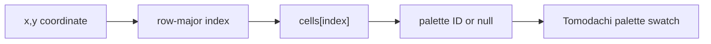

### Core Grid Helpers

| Function | Purpose |
| --- | --- |
| `createGridDocument` | Creates a new empty or filled grid |
| `getCell` | Reads one cell at x/y |
| `setCell` | Returns an immutable copy with one edited cell |
| `setCells` | Returns an immutable copy with a batch edit |
| `bresenhamLine` | Produces drag interpolation points so fast strokes do not leave gaps |
| `replaceColor` | Merges or replaces one color ID with another |
| `resizeGrid` | Resizes by preserving existing cell positions |
| `resampleGridNearest` | Nearest-neighbor resampling for detail upscaling |
| `recomputeUsedColors` | Rebuilds the used-color list after mutations |

## 8. Studio Workspace Implementation

The main editor is `client/src/pages/Studio.tsx`.

It wires together:

- `CanvasViewer`
- `ImportPanel`
- `CreationPanel`
- `PalettePanel`
- `OptimizerPanel`
- `AiPanel`
- `ExportPanel`
- `useGridDocument`

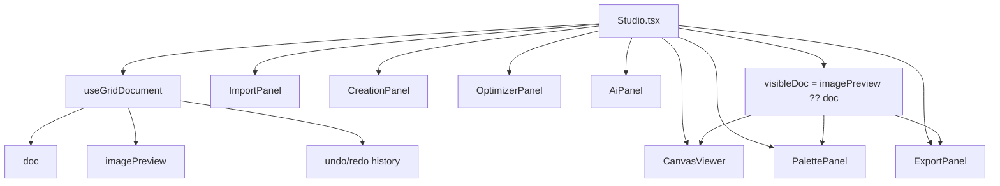

Key behavior:

- If an image preview exists, the canvas shows `imagePreview` instead of overwriting the real document.
- Export is disabled until the preview is committed or canceled.
- Paint tools are disabled against preview-only state so the user does not accidentally edit a not-yet-committed image conversion.
- Undo/redo comes from `useGridDocument`.
- The current selected color is controlled in `Studio.tsx`.

### Paint Tools

`CreationPanel.tsx` exposes the active tool:

```ts
type PaintTool = "inspect" | "pencil" | "eraser" | "eyedropper" | "fill";
```

Tool behavior:

| Tool | Behavior |
| --- | --- |
| Inspect | Lets the user inspect cells without changing them |
| Pencil | Paints selected palette ID |
| Eraser | Sets cells to `null` |
| Eyedropper | Reads the clicked cell color and selects it |
| Fill | Flood-fills a contiguous region using BFS |

Drag painting uses `CanvasViewer` plus `bresenhamLine` so quick mouse movement still paints a continuous stroke.

## 9. Document State, History, And Preview Flow

`client/src/hooks/useGridDocument.ts` is the state layer.

It owns:

- `doc`
- `imagePreview`
- `history`
- `historyIndex`
- `isLoading`
- `error`

### Undo/Redo

History is append-only from the user's perspective, capped at 50 entries. When a new edit happens after undoing, future history is discarded before adding the new entry.

### Stroke Transactions

Paint strokes are grouped:

1. `beginStroke()` captures the starting document.
2. Drag batches use `paintCells()`.
3. `endStroke()` appends only the final state to history.

This prevents one long drag from becoming dozens or hundreds of undo entries.

### Image Preview

Image import can run as a preview:

1. `previewFromImage(file, options)` converts the image into a temporary `GridDocument`.
2. `imagePreview` is shown on canvas.
3. User can adjust import settings.
4. `Commit Preview` moves the preview into `doc` and history.
5. `Cancel` discards it.

This directly fixes the old problem where changing grid size or import settings required uploading the image again.

## 10. Image Import Pipeline

The import pipeline lives in:

- `client/src/components/studio/ImportPanel.tsx`
- `client/src/lib/engine/image-import.ts`

### User-Facing Import Controls

`ImportPanel` supports:

- Drag and drop.
- Image picker.
- JSON picker.
- Same-file reprocessing.
- Subject-position focus target.
- Grid width/height controls.
- Use-case presets.
- Brightness, contrast, saturation.
- Frame mode.
- Sampling mode.
- Background handling.
- Preview/commit/cancel.

### Supported File Types

Images:

- PNG
- JPG/JPEG
- GIF
- WebP
- AVIF
- BMP

Data:

- JSON

### Use-Case Presets

| Preset | Size | Important Settings |
| --- | ---: | --- |
| Mii Mask | 64x64 | face focus high, background flatten, moderate colors |
| Character 64 | 64x64 | crisp sampling, stronger contrast/saturation |
| Face 96 | 96x96 | more facial detail, background flatten |
| Character 128 | 128x128 | higher detail, more colors |
| Sprite 32 | 32x32 | contain mode, high contrast, crisp sampling |
| Logo 64 | 64x64 | contain mode, limited colors |
| Sticker 64 | 64x64 | contain mode, bold colors |
| Icon 16 | 16x16 | strong contrast, very limited colors |
| Full Image | 64x64 | contain mode, keeps background |
| Pixel Detail | 256x256 | max detail path, no color limit by default |

### ImageImportOptions

```ts
interface ImageImportOptions {
  gridWidth: number;
  gridHeight: number;
  maxColors: number;
  useGamePalette: boolean;
  frameMode: "cover" | "contain" | "stretch";
  focusX: number;
  focusY: number;
  brightness: number;
  contrast: number;
  saturation: number;
  backgroundMode: "keep" | "flatten";
  backgroundTolerance: number;
  backgroundColor: RGB;
  samplingMode: "smooth" | "crisp";
}
```

### Conversion Flow

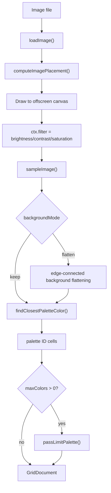

### Background Flattening

The background flattener estimates an edge background color and removes edge-connected pixels within a tolerance. This matters for portraits because the app should prioritize face/mask readability instead of wasting palette slots on a wall, mugshot backdrop, or screenshot background.

### Palette Matching

Color matching uses:

- RGB to CIELAB conversion.
- CIE76 Delta E distance.
- `findClosestPaletteColor()`.

This is better than direct RGB distance because it is closer to perceptual color difference.

## 11. JSON And Living The Grid Import

JSON handling lives in `client/src/lib/engine/json-io.ts`.

Supported import paths:

1. Native project JSON exported by this app.
2. Living The Grid JSON v2 style format with:
   - `width`
   - `height`
   - `palette`
   - `pixels` or `grid`
   - metadata such as `source`, `version`, `brush`, `canvas`

### LTG Conversion Flow

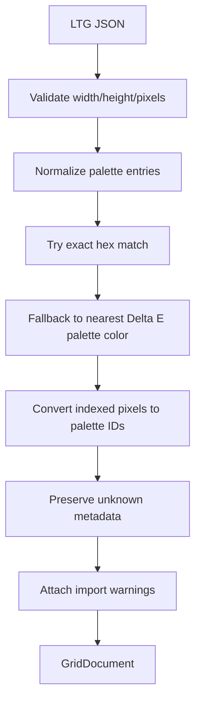

Important behavior:

- Palette entries can be strings or objects such as `{ hex, rgb, press }`.
- Original H/S/B press metadata is preserved in source metadata where present.
- Exact palette matches are preferred.
- Approximate mappings produce import warnings.
- Unknown LTG metadata is kept instead of being discarded.

## 12. Palette System

The palette is defined in `client/src/lib/engine/palette.ts`.

It includes:

- 77 base colors arranged as 11 rows x 7 columns.
- 7 saturated extras.
- 84 total entries.

Each color has:

```ts
interface PaletteColor {
  id: string;
  name: string;
  hex: string;
  rgb: [number, number, number];
  row: number;
  col: number;
  isSaturated: boolean;
}
```

Examples:

| ID | Meaning |
| --- | --- |
| `R10C1` | Black |
| `R10C7` | White |
| `R9C5` | Beige |
| `R11C1` | Charcoal |
| `R1C2` | Red |
| `R6C3` | Bright Blue |
| `S1` to `S7` | Saturated extras |

Current caveat:

- The palette has row/column, hex, RGB, and display names.
- It does not yet include complete in-game H/S/B press-count recipes as first-class fields.

## 13. Canvas Rendering And Coordinate Mapping

Canvas code lives in `client/src/lib/engine/canvas-renderer.ts` and `client/src/components/studio/CanvasViewer.tsx`.

### Renderer Responsibilities

`canvas-renderer.ts` handles:

- Drawing each cell.
- Drawing grid lines.
- Drawing labels.
- Highlighting a selected/hovered color.
- Converting canvas coordinates to grid cells.
- Exporting grid PNGs.
- Exporting palette-sheet PNGs.

### Viewer Responsibilities

`CanvasViewer.tsx` handles:

- Device pixel ratio scaling.
- Resize observation.
- Fit-to-container cell sizing.
- Zoom with mouse wheel.
- Alt/middle-button panning.
- Hover readout.
- Mouse stroke lifecycle.
- Bresenham interpolation between sampled mouse positions.

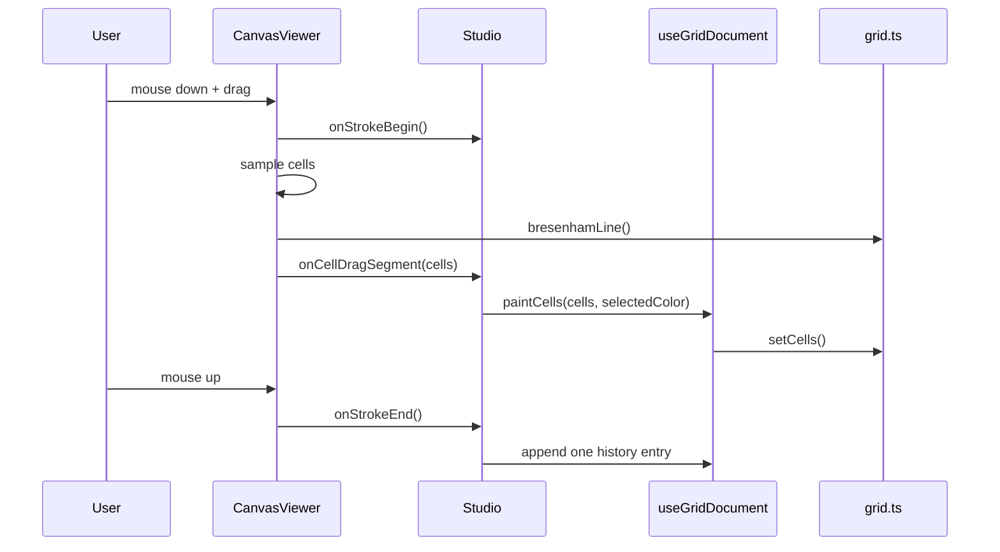

## 14. Optimizer Implementation

The optimizer lives in `client/src/lib/engine/optimizer.ts`.

It is deterministic and currently runs these passes:

1. Merge similar colors.
2. Remove islands.
3. Clean single cells.
4. Limit palette.

### Optimizer Config

```ts
interface OptimizerConfig {
  mergeThreshold: number;
  maxIslandSize: number;
  cleanupSingleCells: boolean;
  maxColors: number;
  lockedColors: string[];
}
```

### Pass Details

| Pass | What It Does | Why It Matters |
| --- | --- | --- |
| `passMergeColors` | Merges less-used visually similar colors under a Delta E threshold | Reduces brush changes |
| `passRemoveIslands` | Finds small connected regions and replaces them with dominant neighboring colors | Removes noisy regions |
| `passCleanupSingleCells` | Removes isolated single-cell artifacts | Makes guides easier to repaint |
| `passLimitPalette` | Repeatedly merges the closest color pair until under the target color count | Creates simpler palette-limited variants |

`lockedColors` protect important colors from being merged or changed by optimizer decisions.

## 15. Creation And Starter Template System

Starter templates live in:

- `client/src/lib/engine/templates.ts`
- `fixtures/creative-templates/*.json`

The templates are original/generic starter designs, not direct copyrighted sprite dumps. They are meant to help the user create fan-style masks, icons, horror characters, mascots, and brand-like marks from safe starting shapes.

### Current Template Categories

| Category | Examples |
| --- | --- |
| People & Masks | Face Guide, Portrait Bust, Arcade Fighter, Space Helmet, Robot Face |
| Characters | Mascot Head, Space Crew, Tiny Dino, Cute Monster, Red Cap Hero, Green Adventurer, Blue Speed Mascot |
| Horror & Spooky | Haunted Mascot, Bald Teacher, Masked Slasher, Pumpkin Ghoul, Ghost Sheet, Vampire Count, Zombie Buddy, Creepy Clown |
| Marks & Objects | Heart Sticker, Star Badge, Smile Icon, Letter Mark, Controller Icon, Racing Kart, Pizza Slice, Sword Badge |

### Template Flow

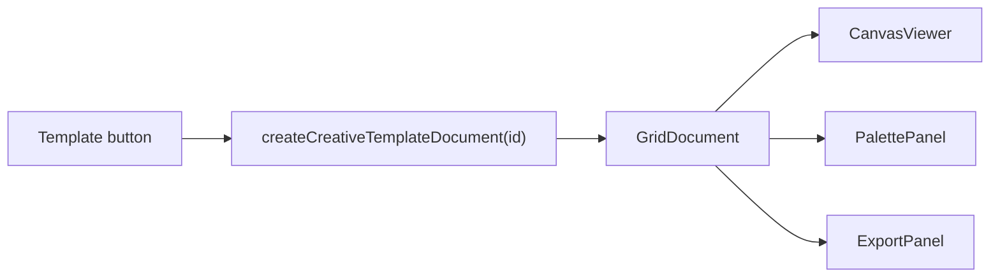

The fixture scripts can regenerate saved JSON fixtures for these templates so template output can be tested and reviewed outside the UI.

## 16. AI Sketch And Chat Implementation

AI code is split between client, shared types, and API helpers.

| File | Role |
| --- | --- |
| `client/src/components/studio/AiPanel.tsx` | UI for chat sessions, model selection, options, sending messages, applying sketches |
| `shared/ai.ts` | Shared request/response/model/sketch TypeScript types and model presets |
| `client/src/lib/engine/ai-sketch.ts` | Converts validated AI sketch rows into a `GridDocument` |
| `server/openrouter.ts` | Shared OpenRouter request, prompt, model list, parsing, salvage logic |
| `functions/api/ai/[[path]].ts` | Cloudflare Pages Function for deployed `/api/ai/*` |
| `vite.config.ts` | Vite middleware for local `/api/ai/*` |

### AI Session Storage

AI sessions are saved in browser `localStorage` under:

```text
ltg.ai.sessions.v1
```

The app keeps up to 20 sessions. This is intentionally local-first. There is no database for V1, which means:

- Good: no account system needed.
- Good: private sketches/chats stay in the browser unless sent to OpenRouter.
- Limitation: no cross-device sync.
- Limitation: clearing browser storage removes sessions.

### AI Request Options

The user can choose:

- Model preset or custom OpenRouter model ID.
- Include current grid summary.
- Include current grid PNG snapshot.
- Request applyable sketch JSON.

If `includeGridImage` is on, `AiPanel` exports the current grid to a clean PNG data URL and sends it as an image part. The receiving model must support image input for real visual critique.

### OpenRouter System Prompt Behavior

The system prompt tells the model to act as an expert pixel-art director inside Tomodachi Studio. When sketch JSON is requested, it requires:

- Valid JSON only.
- Default 16x16 unless user asks larger.
- Palette color IDs only.
- `null` for transparent/empty cells.
- Multiple colors.
- Clear shapes.
- Exact row/column counts.

### AI Sketch Validation

`createGridDocumentFromAiSketch()` enforces:

- Width and height must be integers from 8 to 64.
- `rows.length` must equal height.
- Each row length must equal width.
- Every non-null cell must be a known palette ID.

If validation passes, the result becomes a normal `GridDocument` with:

```text
meta.sourceFormat = "ai-openrouter-sketch"
meta.sourceMetadata.generatedBy = "OpenRouter"
```

### AI Response Salvage

`server/openrouter.ts` includes a best-effort parser for truncated JSON. If a model starts a valid sketch but runs out of tokens, the parser attempts to recover complete rows, pads missing rows with `null`, and returns a warning.

This is useful because free/cheap models often truncate long grids.

## 17. Resident And Abstraction-Island Data

Resident planning data lives in `shared/residents.ts`.

This file defines:

- `QuestHook`
- `MiiResidentSpec`
- `IslandDistrict`
- `IslandGrowthStage`
- `IslandFacilityPlan`
- `ResidentCreationStep`
- `CrossLayerInteraction`
- `DISTRICTS`
- `STARTER_RESIDENTS`
- validation helpers

### Districts Currently Modeled

| District | Role |
| --- | --- |
| Silicon Beach | Physical invention layer |
| Boolean Boardwalk | Logic and truth-table layer |
| Circuit Plaza | NAND, combinational, and sequential circuit layer |
| Architecture Atrium | CPU, stored-program, and machine model layer |
| Assembly Avenue | Machine language and assembler layer |
| VM Village | Stack VM and hardware-independence layer |
| Compiler Grove | Language, syntax, parsing, and compilation layer |
| Oz Oasis | Computation model and concurrency layer |
| Perlis Peak | Programming philosophy and language-thought layer |

### QuestHook Shape

```ts
interface QuestHook {
  id: string;
  title: string;
  trigger: "residentChat" | "districtBridge" | "relationshipConflict" | "studySession";
  input: string;
  artifactType: "truthTable" | "circuit" | "assembly" | "vmTrace" | "program" | "stateTrace";
  bridgeQuestion: string;
  expectedOutput: string;
  correctionHint: string;
  retryVariant: string;
  acceptanceKeywords?: string[];
}
```

### How Resident Specs Connect To Exports

`ExportPanel.tsx` checks:

```ts
doc.meta.sourceMetadata?.miiResidentSpec
```

If it validates with `validateMiiResidentSpec()`, the exported HTML reference page includes resident details such as:

- Resident name.
- District.
- Bridge below.
- Bridge above.
- Pixel notes.
- Source credits.

The resident feature sheet is not currently a full visible editor tab in the studio. The schema and export validation path exist, but the UI tab was removed in a later pass.

## 18. Export System

Export code lives in:

- `client/src/components/studio/ExportPanel.tsx`
- `client/src/lib/engine/json-io.ts`
- `client/src/lib/engine/canvas-renderer.ts`

### Export Buttons

| Button | Output |
| --- | --- |
| Export JSON | Project JSON |
| Export Guide (with labels) | Labeled PNG guide |
| Export Clean Image | Grid PNG without labels/grid lines |
| Export Reference Pack | Multiple downloads: JSON, labeled guide PNG, palette sheet PNG, HTML reference page |

### Current Reference Pack Behavior

The reference pack is not a ZIP yet. It triggers several separate browser downloads:

- `${project}-guide-labeled.png`
- `${project}-palette-sheet.png`
- `${project}-reference.html`
- project JSON

The HTML reference includes:

- Project name.
- Grid size.
- Used color count.
- Fan-made/unaffiliated note.
- Optional validated resident feature sheet.
- Palette swatches.
- Full project JSON in a `<pre>` block.

### Known Export Copy Drift

Some crawler-shell/public-copy text refers to a PDF reference pack. The actual implemented export path currently generates PNG, JSON, palette sheet PNG, and HTML. PDF export is not implemented in the current code.

## 19. Public Visual Assets

These are the raster/static assets in `client/public/`.

| Asset | Used For |
| --- | --- |
| `hero.webp` | Public homepage hero/branding visual |
| `canvas-demo.webp` | Studio/demo visual |
| `empty-state.webp` | Empty state illustration |
| `palette-swatches.webp` | Palette preview visual |
| `og-image.png` | OpenGraph/social card image |
| `icon-192.png` | PWA/app icon |
| `icon-512.png` | PWA/app icon |
| `icon-maskable.png` | Maskable PWA icon |
| `manifest.webmanifest` | PWA metadata |
| `ads.txt` | Ad network declaration |
| `robots.txt` | Search/AI crawler policy |
| `sitemap.xml` | Page sitemap |
| `sitemap-images.xml` | Image sitemap |
| `_headers` | Cloudflare Pages HTTP headers |
| `_redirects` | Cloudflare Pages redirects |

### Embedded Asset Preview Paths

These links render when the Markdown viewer supports local relative images:

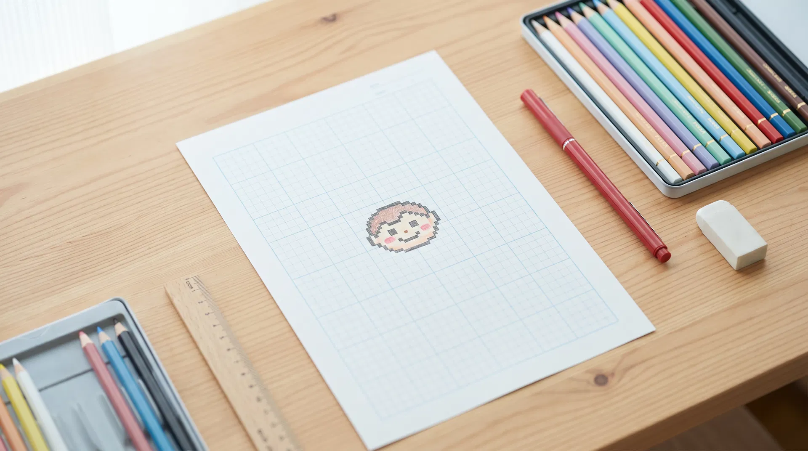

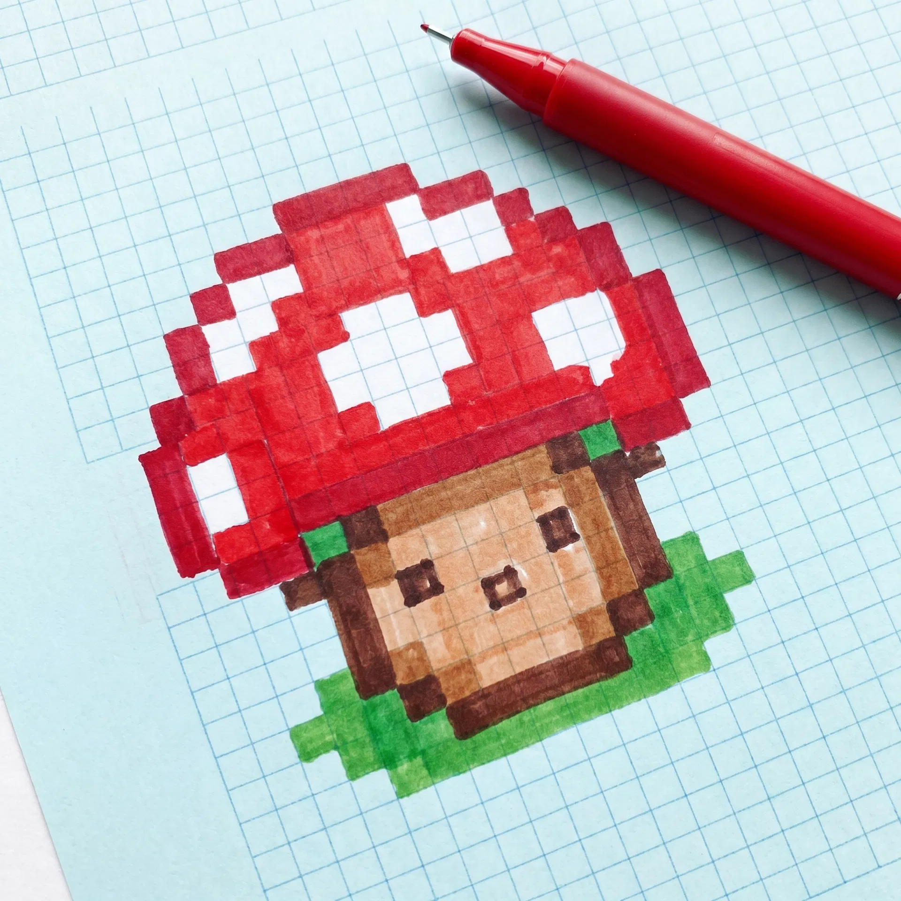

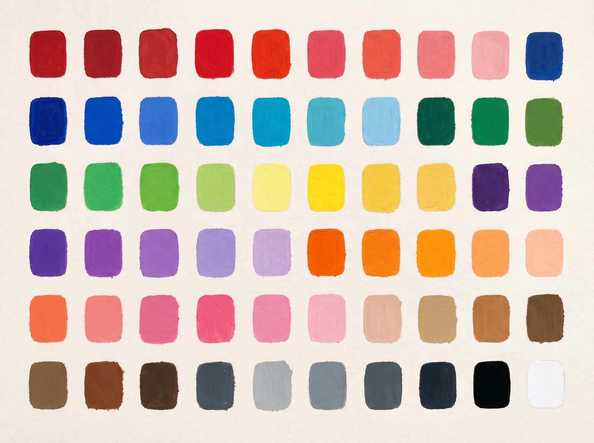


## 20. Cloudflare Pages, Functions, And Security

### Deployment Config

`wrangler.toml` defines:

```toml
name = "tomodachi-studio"
compatibility_date = "2025-05-01"
compatibility_flags = ["nodejs_compat"]
pages_build_output_dir = "dist/public"
PUBLIC_SITE_URL = "https://tomodachi.pw"
```

It also declares the KV namespace binding:

```toml
[[kv_namespaces]]
binding = "EDGE_CACHE"
id = "5129b5ce8d2d435cb704b398a437f355"
```

### Pages Functions

| Route | File | Purpose |
| --- | --- | --- |
| `/api/ai/status` | `functions/api/ai/[[path]].ts` | Report whether OpenRouter key is configured |
| `/api/ai/models` | `functions/api/ai/[[path]].ts` | Return model presets with optional OpenRouter availability, cached in KV |
| `/api/ai/chat` | `functions/api/ai/[[path]].ts` | Send chat/sketch requests to OpenRouter |
| `/api/stripe/products` | `functions/api/stripe/[[path]].ts` | List public products |
| `/api/stripe/checkout` | `functions/api/stripe/[[path]].ts` | Create Stripe Checkout session |
| `/api/stripe/session` | `functions/api/stripe/[[path]].ts` | Verify Checkout session |
| Stripe webhook | `functions/api/webhooks/stripe.ts` | Stripe webhook handler |

### Edge Middleware

`functions/_middleware.ts` serves crawler-specific HTML shells:

- Social crawlers get compact OpenGraph/Twitter metadata.
- Search crawlers get static text, internal links, and JSON-LD.
- Regular users get the normal SPA.

The middleware sets `Vary: User-Agent` so crawler shells do not get mixed with browser responses.

### HTTP Security Headers

`client/public/_headers` configures:

- `X-Content-Type-Options: nosniff`
- `X-Frame-Options: DENY`
- `Referrer-Policy: strict-origin-when-cross-origin`
- `Permissions-Policy`
- `Strict-Transport-Security`
- `X-DNS-Prefetch-Control`
- `Content-Security-Policy`
- `Content-Security-Policy-Report-Only` for Trusted Types observation
- long immutable cache for `/assets/*`
- no-cache for `/index.html`
- no-store for `/api/*`

### Robots And AI Crawlers

`client/public/robots.txt`:

- Allows social preview bots.
- Allows normal search indexing.
- Adds content signals:
  - `search=yes`
  - `ai-input=no`
  - `ai-train=no`
- Disallows known AI/training crawlers such as GPTBot, ClaudeBot, CCBot, Bytespider, Google-Extended, PerplexityBot, and others.

Important distinction:

- `robots.txt` is advisory.
- Cloudflare Bot Management / AI bot blocking is the enforcement layer.

### Cloudflare Security Helper

`scripts/cloudflare-security-insights.ts` helps audit and apply:

- AI bots protection: `block`
- crawler protection: `enabled`
- managed robots mode: `policy_only`
- skip-rule review
- Worker route audit

It needs a Cloudflare API token with permissions such as:

- `Zone:Bot Management:Read`
- `Zone:Bot Management:Edit`
- `Zone:Zone WAF:Read`
- `Zone:Zone WAF:Edit`
- `Zone:Workers Routes:Read`
- `Zone:Workers Routes:Edit`
- `Account:Workers Scripts:Read`

Secrets are expected through env vars such as:

```text
CLOUDFLARE_API_TOKEN
CF_API_TOKEN
CLOUDFLARE_ZONE_ID
CLOUDFLARE_ZONE_NAME
```

The user has indicated these are managed through Doppler.

## 21. Stripe Product And Checkout Implementation

Stripe code is split across:

- `shared/products.ts`
- `server/stripe.ts`
- Vite dev middleware in `vite.config.ts`
- Cloudflare Pages Function under `functions/api/stripe/[[path]].ts`

### Product Catalog

`shared/products.ts` is the source of truth for sellable products.

Current categories:

- `recovery`
- `consult`
- `support`

Current products include:

- `breach-recovery-checklist`
- `consult-30`
- `support-jar-5`
- `support-jar-15`
- `support-jar-25`

### Why The Stripe SDK Is Not Used

`server/stripe.ts` uses direct REST calls instead of the official Stripe Node SDK because Cloudflare Workers do not support every Node crypto API the SDK expects. The project manually flattens nested objects into Stripe form encoding.

## 22. Local Development Runtime

The main scripts are in `package.json`.

| Command | Purpose |
| --- | --- |
| `pnpm install` | Install dependencies |
| `pnpm dev` | Start Vite dev server on port 3000 or next available port |
| `pnpm build` | Build Vite app and bundle Express server |
| `pnpm start` | Run production Express server from `dist/index.js` |
| `pnpm preview` | Preview Vite build |
| `pnpm check` | TypeScript check |
| `pnpm verify` | Type-check plus core verification scripts |
| `pnpm verify:studio` | Browser-style studio verification script |
| `pnpm cloudflare:security-insights` | Cloudflare security audit/helper |
| `pnpm compare:models` | Compare OpenRouter model behavior |
| `pnpm save:templates` | Save creative template fixtures |

### Vite Dev Middleware

`vite.config.ts` adds local middleware for:

- `/api/ai/status`
- `/api/ai/models`
- `/api/ai/chat`
- `/api/stripe/products`
- `/api/stripe/checkout`
- `/api/stripe/session`

This lets local development use the same endpoint shapes as Cloudflare Pages.

### Manus Debug Tooling

The Vite config includes Manus debug collector/runtime tooling only in dev mode. Production does not inject this runtime.

## 23. Environment Variables And Secrets

The project expects secrets from the shell, Doppler, Cloudflare Pages, or Wrangler, not from committed files.

| Variable | Used By | Purpose |
| --- | --- | --- |
| `OPENROUTER_API_KEY` | AI API | Authenticate OpenRouter requests |
| `PUBLIC_SITE_URL` | AI/Stripe/Cloudflare | Referer, success URLs, canonical site URL |
| `STRIPE_SECRET_KEY` | Stripe API | Create and verify checkout sessions |
| `STRIPE_WEBHOOK_SECRET` | Stripe webhook | Verify Stripe webhook signatures |
| `CLOUDFLARE_API_TOKEN` / `CF_API_TOKEN` | Cloudflare script | Bot/security config audit/apply |
| `CLOUDFLARE_ZONE_ID` | Cloudflare script | Optional direct zone lookup |
| `CLOUDFLARE_ZONE_NAME` | Cloudflare script | Defaults to `tomodachi.pw` |
| `EDGE_CACHE` | Cloudflare Pages Function binding | KV cache for OpenRouter models |

## 24. Verification Coverage

Current verification scripts:

| Script | What It Verifies |
| --- | --- |
| `verify-ltg-import.ts` | Living The Grid fixture import compatibility |
| `verify-image-import.ts` | Image import path and options |
| `verify-creative-templates.ts` | Starter templates produce valid grid docs |
| `verify-ai-sketch.ts` | AI sketch validation/conversion |
| `verify-residents.ts` | Resident schema/spec validity |
| `verify-studio-browser.ts` | Browser-style studio smoke path |

`pnpm verify` runs:

```text
pnpm check
pnpm verify:ltg
pnpm verify:image-import
pnpm verify:templates
pnpm verify:ai-sketch
pnpm verify:residents
```

`verify:studio` is available separately.

## 25. Fixtures

Fixtures are used for repeatable testing and documentation.

| Fixture | Purpose |
| --- | --- |
| `fixtures/living-the-grid-real.json` | Real Living The Grid export fixture |
| `fixtures/ltg-indexed-palette-sample.json` | Smaller indexed palette sample |
| `fixtures/sample-grid-document.json` | Native app grid document sample |
| `fixtures/creative-templates/*.json` | Saved outputs for starter designs |
| `fixtures/creative-templates/index.json` | Template fixture index |

## 26. Full Studio Data Flow

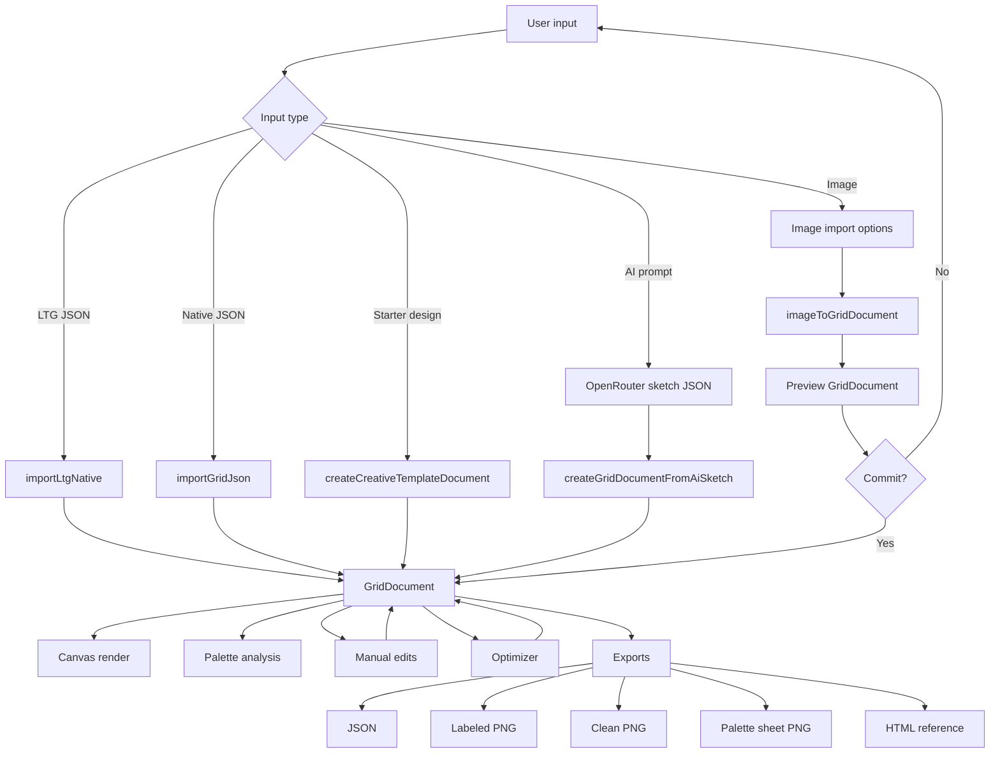

## 27. What Was Recently Improved

Based on the current code, these improvements are already implemented:

- Image upload accepts common browser image formats including AVIF.
- Image import uses preview before commit.
- Same uploaded image can be reprocessed when grid size/options change.
- Subject position can be adjusted with a draggable target over the source image.
- Background flattening exists for face/character import.
- Brightness, contrast, saturation, frame mode, focus, sampling mode, and color limits are part of import options.
- Detail presets include 64, 96, 128, and 256 paths.
- Manual pixel editing exists through pencil, eraser, eyedropper, fill, and inspect.
- Drag painting groups into a single undo history entry.
- Fast drag strokes use Bresenham interpolation.
- Canvas detail can be upscaled/resampled after creation.
- Starter designs include people/masks, generic characters, horror/spooky, and object/mark designs.
- AI chat sessions are saved locally.
- AI models can return applyable sketch JSON.
- AI can optionally receive a current-grid visual snapshot.
- AI sketch output is validated against palette IDs before being applied.
- Export includes guide PNGs, palette sheet PNG, JSON, and HTML reference.
- Resident schema and abstraction-island planning data exist in shared code.
- Cloudflare security helpers and robots policy exist for AI bot/crawler controls.

## 28. Known Gaps And Best Next Improvements

These are the most useful next engineering targets.

| Priority | Improvement | Why It Matters |
| --- | --- | --- |
| P0 | Run full live browser verification after every import/export change | The studio is visual and file-based; browser proof matters more than static reading |
| P1 | Add crop rectangle, not just focus point | Face/mask imports need exact framing, especially portraits |
| P1 | Add per-pass optimizer preview and change log | Makes optimization trustworthy instead of magical |
| P1 | Add repaintability score | Shows why one grid is easier to paint than another |
| P1 | Add ZIP reference-pack export | The current reference pack downloads multiple files separately |
| P2 | Add in-game H/S/B press-count data to `PaletteColor` | Makes output more game-ready |
| P2 | Add editable resident feature-sheet UI | Schema exists, but the studio UI tab is not currently active |
| P2 | Move heavy image/optimizer/export work into a Web Worker | Prevents UI blocking at 128x128 and 256x256 |
| P2 | Add Playwright visual tests | Pixel output and upload flows need browser-level regression checks |
| P3 | Add optional local database/cloud sync only after V1 | Current AI sessions are local-first by design |

## 29. Implementation Constraints To Preserve

These constraints keep the project coherent:

- Keep `GridDocument.cells` as palette IDs, not raw hex strings.
- Keep engine modules pure and React-free when possible.
- Keep import/optimizer/export deterministic.
- Keep AI as a suggestion/sketch layer, not an unvalidated grid mutator.
- Keep source image reprocessing non-destructive.
- Keep preview separate from committed document state.
- Keep secrets out of repo files.
- Keep resident/source credits and fan-made/unaffiliated notes in exports.
- Keep starter designs original/generic and let users adapt local assets themselves.

## 30. Quick Mental Model

```text
Files, photos, templates, or AI prompts
  -> normalized into GridDocument
  -> displayed through CanvasViewer
  -> edited through useGridDocument
  -> simplified through optimizer passes
  -> exported as repaintable guide assets
```

The project works best when every new feature answers this question:

```text
Does this make the final grid easier, clearer, or more accurate to repaint in the game?
```
