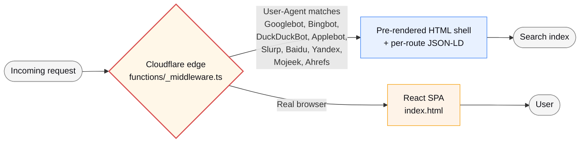
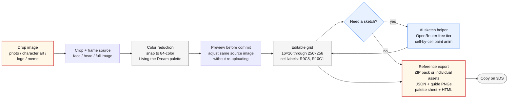

# Tomodachi

> A browser-first Mii pixel-art studio paired with practical breach-recovery guides for Tomodachi Life players.

[](https://tomodachi.pw/)
[](https://tomodachi.brave)
[](./LICENSE)
[](https://tomodachi.pw/support)

<p align="center">
  
</p>

Two things stacked on one site. The **Studio** is a browser-first pixel-art editor for Mii face masks. Import a face photo or character art, reduce the colors against the in-game Tomodachi Life: Living the Dream palette, and export a paint-by-numbers reference you can recreate on a real 3DS. The **recovery hub** is for visitors arriving from the Tomodachishare credential leak: free, calm, no-spam steps to rotate passwords and lock down accounts.

## Why this exists

The 3DS touch editor is fine for freehand sketching but brutal for anything reference-based. Recreating a face from a photo means picking colors one at a time from a tiny on-screen palette while squinting at a print-out next to the console. A desktop editor that snaps to the same 84-color palette and exports a paint-by-numbers reference is 10x faster, and works on phones too.

The recovery section came later. When the Tomodachishare leak hit, players started showing up to community channels looking for somewhere calm and free to learn what to do next. So this site does both: a real tool for a hobby, and a soft landing for people in a bad week.

## Features

**Studio** — [`/studio`](https://tomodachi.pw/studio)

- 16×16 through 256×256 import/detail presets that snap to the 84-color Tomodachi Life: Living the Dream palette
- Every color labeled by row + column (R9C5, R10C1, etc.) for exact in-game matching
- Image import with preview-before-commit, same-file reprocessing, subject focus, background flattening, brightness/contrast/saturation, and readability-preserving color reduction
- Manual pencil, eraser, eyedropper, fill, inspect, undo/redo, and detail-upscale tools
- AI sketch assistant with local chat sessions, optional grid snapshot context, validation, and cell-by-cell apply animation
- Export individual repaint assets or a ZIP reference pack with JSON, labeled PNG guide, clean PNG, palette sheet PNG, paint-order CSV, notes, manifest, and HTML reference

**Recovery hub** — [`/`](https://tomodachi.pw/)

- Browser-only password breach check using HIBP k-anonymity (only the first 5 chars of the SHA-1 hash ever leave the page)
- OpenRouter-backed AI recovery assistant on free-tier models (no signup)

**Guides** — [`/guides`](https://tomodachi.pw/guides)

- Long-form articles on Mii creation, gameplay basics (apartments / food / jobs / marriage), Tomodachishare recovery, QR codes + save backup

**AI action plan + project support**

- [`/ai-plan`](https://tomodachi.pw/ai-plan) — free AI action-plan beta; a distinct one-time $5 creator plan is product direction only and is not for sale
- [`/support`](https://tomodachi.pw/support) — non-payment ways to test the Studio, report issues, and send feedback

## Tech stack

- **Frontend:** Vite, React 19, TypeScript 5, Tailwind CSS v4 (OKLCH color space), shadcn/ui/Radix primitives, wouter
- **Edge runtime:** Cloudflare Pages Functions (TypeScript)
- **Edge cache:** Cloudflare KV (1-hour TTL on the OpenRouter model list)
- **Payments:** retired; legacy payment paths return provider-free `410 Gone` tombstones
- **AI:** OpenRouter with free-tier model rotation (DeepSeek V4 Flash, GPT-OSS 120B, GLM 4.5 Air, Nemotron 3 Super 120B)
- **Secrets:** Doppler → Cloudflare Pages integration
- **Analytics:** Cloudflare Web Analytics (cookieless, no PII)

For the detailed implementation atlas, see [`PROJECT_STACK_AND_IMPLEMENTATION.md`](./PROJECT_STACK_AND_IMPLEMENTATION.md).

## Edge pre-render for search crawlers

Most SPAs are invisible to Bing / DuckDuckGo because they don't execute JavaScript at index time. The standard fixes are prerender.io (extra runtime cost) or full SSR (extra framework cost). This project takes a third route:



One TypeScript file at the edge UA-sniffs known search crawlers and serves route-appropriate JSON-LD: `WebApplication` on `/`, `SoftwareApplication` + `BreadcrumbList` on `/studio`, `CollectionPage` with embedded `HowTo` + `Article` on `/guides`, `FAQPage` on `/faq`, `AboutPage` + `Organization` on `/about`, `Article` on `/help`, and informational `WebPage` shells on `/ai-plan` and `/support`. Real browsers continue to get the React app. No build-step prerender, no separate SSR runtime, no Next.js — just one edge function and a `ROUTES` map.

See [`functions/_middleware.ts`](./functions/_middleware.ts) for the implementation.

## Studio workflow



## Quick start

```bash
pnpm install
pnpm dev          # Vite dev server on http://localhost:3000
pnpm check        # TypeScript type check
pnpm verify       # Full verification suite (LTG import, image import, templates, AI sketch, residents)
```

To run the Cloudflare Pages Functions locally:

```bash
pnpm build
pnpm wrangler pages dev dist/public --compatibility-date=2025-05-01
```

Required environment variables (set via `.env.local` for dev, via Doppler → Cloudflare Pages for prod):

| Variable                        | Required for                   | Notes                              |
| ------------------------------- | ------------------------------ | ---------------------------------- |
| `OPENROUTER_API_KEY`            | AI sketch + recovery assistant | Free-tier key works                |
| `PUBLIC_SITE_URL`               | Sitemap canonical URLs         | Defaults to `https://tomodachi.pw` |
| `VITE_ADSENSE_PUBLISHER_ID`     | Optional, AdSense              | Only loaded after cookie consent   |
| `VITE_ADSENSE_HOMEPAGE_SLOT_ID` | Optional, AdSense              | Homepage slot ID                   |

## Project structure

```
client/                  Vite + React SPA
  src/
    pages/               Route components (Home, Studio, AI Plan, Guides, FAQ, About, Help, Support, legal)
    components/
      studio/            AI panel, palette grid, import panel, etc.
      ui/                shadcn/ui primitives
    hooks/               useDocumentTitle, useStructuredData, useGridDocument
    lib/                 engine (JSON import/export, palette ops), breadcrumb, consent
  public/                Static assets (sitemap.xml, og-image.png, robots.txt, _headers, manifest)
functions/               Cloudflare Pages Functions
  _middleware.ts         Search-crawler pre-render + per-route JSON-LD
  api/
    ai/[[path]].ts       OpenRouter chat + KV-cached model list
    stripe/[[path]].ts   Provider-free 410 tombstone for retired payment clients
    webhooks/stripe.ts   Provider-free 410 tombstone for retired webhook deliveries
server/                  Shared TS modules imported by Functions + dev middleware
shared/                  Types shared between client + functions (ai, residents, const)
fixtures/                Real-world JSON fixtures for the verify scripts
scripts/                 Verification scripts run by `pnpm verify`
```

## Contributing

PRs welcome. Small focused changes get reviewed faster than large refactors.

The codebase is intentionally small and readable. The design philosophy (Paper Studio: Japanese stationery minimalism, off-white paper surface, graphite text, pale blue grid accents, warm red as the sole accent color, OKLCH color space throughout) is documented inline in [`client/src/index.css`](./client/src/index.css).

Before opening a PR:

```bash
pnpm check        # tsc --noEmit
pnpm verify       # Full verification suite
```

## Help improve the project

If the Studio or guides have helped, useful ways to support the project are:

- Test a real drawing, import, export, or AI workflow and send specific feedback.
- Report reproducible bugs or accessibility issues through [GitHub Issues](https://github.com/RazonIn4K/Mii-pixelart/issues).
- Try the free [AI Action Plan beta](https://tomodachi.pw/ai-plan) and verify every recommendation before acting.

Tomodachi currently accepts no payments, tips, donations, or consultation bookings.

## License

[MIT](./LICENSE). This is an unofficial fan tool. Tomodachi Life is a trademark of Nintendo Co., Ltd. — this project is not affiliated with, endorsed by, or sponsored by Nintendo.

## Acknowledgements

- The Tomodachi Life community for keeping the game alive a decade after launch
- [HIBP](https://haveibeenpwned.com/) for the k-anonymity password-breach API
- [shadcn/ui](https://ui.shadcn.com/) for the component primitives
- [OpenRouter](https://openrouter.ai/) for free-tier access to multiple LLMs without per-provider sign-up
- Every player who showed up after the Tomodachishare leak and made the recovery hub feel necessary
