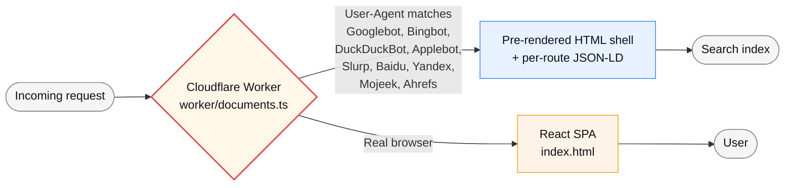
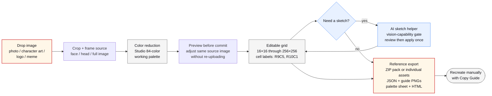

# Tomodachi

> A browser-first Mii pixel-art studio paired with practical breach-recovery guides for Tomodachi Life players.

[](https://tomodachi.pw/)
[](https://tomodachi.brave)
[](./LICENSE)
[](https://tomodachi.pw/support)

<p align="center">
  
</p>

Two things stacked on one site. The **Studio** is a browser-first pixel-art editor for planning Mii-inspired face art. Import a face photo or character art, reduce the colors against the Studio's 84-color working palette, and export a paint-by-numbers Copy Guide for manual recreation in a game's drawing tools. It does not transfer game files or connect to a Nintendo title. The **recovery hub** is for visitors arriving from the Tomodachishare credential leak: free, calm, no-spam steps to rotate passwords and lock down accounts.

## Why this exists

Freeform console editors are fine for sketching but difficult for reference-based work. Recreating a face from a photo means choosing colors manually while comparing the source on another screen. A browser editor that reduces the image to a consistent 84-color working palette and exports a paint-by-numbers Copy Guide makes that planning easier, and it works on phones too. The palette and grid dimensions are Studio conventions rather than verified proprietary game data.

The recovery section came later. When the Tomodachishare leak hit, players started showing up to community channels looking for somewhere calm and free to learn what to do next. So this site does both: a real tool for a hobby, and a soft landing for people in a bad week.

## Features

**Studio** — [`/studio`](https://tomodachi.pw/studio)

- 16×16 through 256×256 import/detail presets that reduce images to the Studio's 84-color working palette
- Every color labeled by row + column (R9C5, R10C1, etc.) for consistent manual matching in the Copy Guide
- Image import with preview-before-commit, same-file reprocessing, subject focus, background flattening, brightness/contrast/saturation, and readability-preserving color reduction
- Manual pencil, eraser, eyedropper, fill, inspect, undo/redo, and detail-upscale tools
- Account-gated AI sketch assistant with local per-user chat sessions, explicit grid-snapshot consent, validation, visual review, and one-step undoable apply
- Export individual repaint assets or a ZIP reference pack with JSON, labeled PNG guide, clean PNG, palette sheet PNG, paint-order CSV, notes, manifest, and HTML reference

**Recovery hub** — [`/`](https://tomodachi.pw/)

- Browser-only password breach check using HIBP k-anonymity (only the first 5 chars of the SHA-1 hash ever leave the page)
- OpenRouter-backed AI recovery assistant on curated free-tier models after Google sign-in

**Guides** — [`/guides`](https://tomodachi.pw/guides)

- Long-form articles on Mii creation, clearly labeled legacy 3DS daily-play basics, Tomodachishare recovery, QR codes + save backup

**Island Workshop community** — opt-in only

- Google OIDC accounts with generated avatars and private cloud projects
- Explicit review before public or unlisted publishing; authentication never publishes work
- Discovery, search, profiles, likes, comments, follows, reports, and role-gated moderation
- Anonymous editing plus JSON, PNG, CSV, HTML, and ZIP exports remain available without an account

**Paid extras** (optional)

- [`/unlock`](https://tomodachi.pw/unlock) — $9 detailed recovery checklist, $49 30-minute consult
- [`/support`](https://tomodachi.pw/support) — $5 / $15 / $25 tip jar

## Tech stack

- **Frontend:** Vite, React 19, TypeScript 5, Tailwind CSS v4 (OKLCH color space), shadcn/ui/Radix primitives, wouter
- **Edge runtime:** One Cloudflare Worker with Static Assets, built through the Cloudflare Vite plugin
- **Community data:** D1 for relational state and FTS5; private R2 for immutable project revisions and generated media
- **Edge cache:** Cloudflare KV (1-hour TTL on the OpenRouter model list)
- **Authentication:** Google authorization-code OIDC, encrypted transaction cookies, and hashed opaque sessions
- **Payments:** Stripe Checkout with HMAC-SHA256 webhook verification at the edge
- **AI:** OpenRouter with capability-checked free-tier rotation (Gemma 4 vision, GPT-OSS 120B, Nemotron 3 Super 120B)
- **Secrets:** Environment-scoped Wrangler secrets, optionally sourced from Doppler after deployment approval
- **Analytics:** Cloudflare Web Analytics (cookieless, no PII)

For the detailed implementation atlas, see [`PROJECT_STACK_AND_IMPLEMENTATION.md`](./PROJECT_STACK_AND_IMPLEMENTATION.md).

## Edge pre-render for search crawlers

Most SPAs are invisible to Bing / DuckDuckGo because they don't execute JavaScript at index time. The standard fixes are prerender.io (extra runtime cost) or full SSR (extra framework cost). This project takes a third route:



The Worker UA-sniffs known search crawlers and serves route-appropriate JSON-LD for legacy routes, plus safe canonical/Open Graph documents for public profiles and creations. Private account pages and unlisted work receive `noindex`. Real browsers continue to get the React app through Static Assets with SPA fallback; there is no separate SSR runtime.

See [`worker/documents.ts`](./worker/documents.ts) for the implementation.

## Studio workflow



## Quick start

```bash
pnpm install
pnpm dev          # Vite dev server on http://localhost:3000
pnpm check        # TypeScript type check
pnpm verify       # Full verification suite (LTG import, image import, templates, AI sketch, residents)
pnpm test:worker  # Worker + local D1/R2 integration and security tests
pnpm test:e2e     # Browser routes at all required responsive widths
```

To run the unified Cloudflare Worker locally, apply the forward-only D1
migrations once and start Vite. To validate the deployable Worker bundle without
contacting Cloudflare:

```bash
pnpm db:migrate:local
pnpm dev
pnpm worker:dry-run
```

Worker secrets use an untracked `.dev.vars` locally and Cloudflare secrets after
an explicit deployment approval. Vite-only `VITE_*` values may use `.env.local`:

| Variable                        | Required for                   | Notes                                               |
| ------------------------------- | ------------------------------ | --------------------------------------------------- |
| `GOOGLE_CLIENT_ID`              | Google sign-in                 | Separate localhost, staging, and production clients |
| `GOOGLE_CLIENT_SECRET`          | Google sign-in                 | Secret; never expose to Vite                        |
| `OIDC_COOKIE_KEY`               | OAuth transaction cookie       | 32 random bytes                                     |
| `SESSION_PEPPER`                | Session-token hashing          | Independent random secret                           |
| `PSEUDONYM_KEY`                 | Privacy-safe abuse identifiers | Independent HMAC secret                             |
| `OPENROUTER_API_KEY`            | AI sketch + recovery assistant | Free-tier key works                                 |
| `STRIPE_SECRET_KEY`             | Paywall + tip jar              | Live or test key                                    |
| `STRIPE_WEBHOOK_SECRET`         | Webhook signature verification | Per-endpoint secret from Stripe dashboard           |
| `PUBLIC_SITE_URL`               | Sitemap canonical URLs         | Defaults to `https://tomodachi.pw`                  |
| `VITE_ADSENSE_PUBLISHER_ID`     | Optional, AdSense              | Only loaded after cookie consent                    |
| `VITE_ADSENSE_HOMEPAGE_SLOT_ID` | Optional, AdSense              | Homepage slot ID                                    |

## Project structure

```
client/                  Vite + React SPA
  src/
    pages/               Route components (Home, Studio, Unlock, Guides, FAQ, About, Help, Support, legal)
    components/
      studio/            AI panel, palette grid, import panel, etc.
      ui/                shadcn/ui primitives
    hooks/               useDocumentTitle, useStructuredData, useGridDocument
    lib/                 engine (JSON import/export, palette ops), breadcrumb, consent, stripeUrl
  public/                Static assets (original WebP artwork, community social card, PWA icons, sitemap, robots, headers)
worker/                  Unified Cloudflare Worker (API, auth, documents, jobs)
migrations/              Forward-only D1 migrations
shared/                  Shared validation and legacy contracts
functions/               Legacy Pages rollback reference; not the active runtime
  api/
    ai/[[path]].ts       KV-cached model list; chat fails closed without Worker auth/rate limits
    stripe/[[path]].ts   Checkout + session verification + products
    webhooks/stripe.ts   Stripe webhook with HMAC verification
server/                  Portable OpenRouter/Stripe helpers shared by legacy parity code and the Worker
fixtures/                Real-world JSON fixtures for the verify scripts
scripts/                 Verification scripts run by `pnpm verify`
```

Visual artwork, deterministic avatars, and Cloudflare media boundaries are documented in [`docs/visual-assets.md`](docs/visual-assets.md).

## Contributing

PRs welcome. Small focused changes get reviewed faster than large refactors.

The codebase is intentionally small and readable. The design philosophy (Paper Studio: Japanese stationery minimalism, off-white paper surface, graphite text, pale blue grid accents, warm red as the sole accent color, OKLCH color space throughout) is documented inline in [`client/src/index.css`](./client/src/index.css).

Before opening a PR:

```bash
pnpm check        # tsc --noEmit
pnpm verify       # Full verification suite
```

## Support and sponsorship

If the studio or the guides have helped, a few ways to support the project:

- **Tip jar:** [tomodachi.pw/support](https://tomodachi.pw/support) — $5 / $15 / $25 via Stripe
- **Paid products:** [tomodachi.pw/unlock](https://tomodachi.pw/unlock) — $9 recovery checklist or $49 30-min consult
- **GitHub Sponsors:** the [`Sponsor`](https://github.com/sponsors/RazonIn4K) button at the top of this repo (once GitHub Sponsors approval clears)
- **Brave Creator:** [tomodachi.brave](https://tomodachi.brave) is verified for Brave Rewards if you tip with BAT

## License

[MIT](./LICENSE). This is an unofficial fan tool. Tomodachi Life is a trademark of Nintendo Co., Ltd. — this project is not affiliated with, endorsed by, or sponsored by Nintendo.

## Acknowledgements

- The Tomodachi Life community for keeping the game alive a decade after launch
- [HIBP](https://haveibeenpwned.com/) for the k-anonymity password-breach API
- [shadcn/ui](https://ui.shadcn.com/) for the component primitives
- [OpenRouter](https://openrouter.ai/) for free-tier access to multiple LLMs without per-provider sign-up
- Every player who showed up after the Tomodachishare leak and made the recovery hub feel necessary
