# Technical Architecture — Living The Grid Repaint Studio

**Version:** 2.0  
**Last Updated:** 2026-05-15

---

## Overview

The studio is a **client-side single-page application** built with React 19 and TypeScript. All processing happens in the browser — no server, no uploads, no accounts. This architecture was chosen to match the privacy-first approach of the original Living The Grid tool and to ensure zero-latency interaction with the pixel grid.

---

## Repository Layout

```
Mii-pixelart/
├── .gitignore
└── living-the-grid-studio/
    ├── client/                    ← React SPA (Vite + TypeScript + Tailwind 4)
    │   ├── index.html
    │   ├── public/                ← Static assets, _headers, _redirects, robots.txt
    │   └── src/
    │       ├── App.tsx            ← Root component + router
    │       ├── main.tsx           ← React DOM entry point
    │       ├── index.css          ← Tailwind + design tokens
    │       ├── const.ts           ← App-wide constants
    │       ├── components/
    │       │   ├── studio/        ← Studio panel components
    │       │   └── ui/            ← shadcn/ui primitives (53 files)
    │       ├── contexts/          ← ThemeContext
    │       ├── hooks/
    │       │   └── useGridDocument.ts  ← Central state hook
    │       ├── lib/
    │       │   └── engine/        ← Pure TS engine (no React deps)
    │       └── pages/             ← Route-level page components
    ├── server/                    ← Thin Express server (dev only)
    │   ├── index.ts
    │   ├── openrouter.ts
    │   └── stripe.ts
    ├── functions/                 ← Cloudflare Pages Functions (edge)
    │   └── api/
    ├── shared/                    ← Shared types/constants
    ├── fixtures/                  ← Test fixtures and creative templates
    ├── scripts/                   ← Verification and utility scripts
    ├── patches/                   ← pnpm patches (wouter)
    ├── package.json
    ├── vite.config.ts
    ├── wrangler.toml
    └── doppler.yaml
```

---

## Technology Stack

| Layer | Technology | Rationale |
|-------|-----------|-----------|
| Framework | React 19 + TypeScript | Type safety for complex grid operations |
| Build | Vite 7 + esbuild | Fast HMR, native ESM; esbuild bundles the server |
| Styling | Tailwind CSS 4 + shadcn/ui | Utility-first with accessible Radix primitives |
| Routing | Wouter | Lightweight client-side routing |
| State | React hooks (`useState`, `useCallback`) | No external state library needed |
| Canvas | HTML5 Canvas API | Direct pixel rendering for grid display |
| Color Science | Custom CIELAB + Delta E (CIE76) | Perceptual color matching |
| Package manager | pnpm | Required; lockfile committed |
| Deploy | Cloudflare Pages + Functions | Edge-hosted SPA + serverless API routes |
| Secrets | Doppler | Runtime injection; no `.env` files committed |

---

## High-Level System Architecture

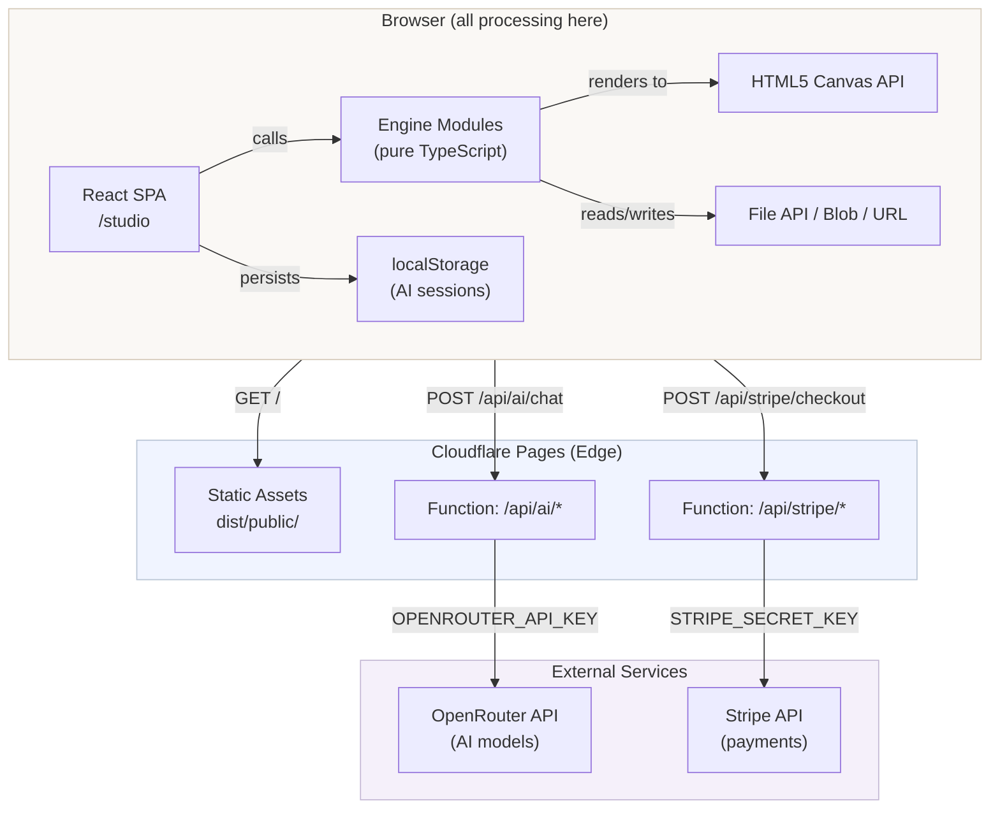

---

## Engine Module Architecture

All engine modules are **pure TypeScript with zero React dependencies**. They can be tested and used outside the UI.

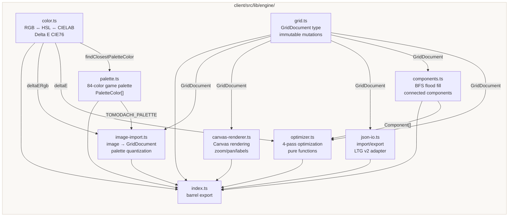

---

## Data Model

The central data structure is the **`GridDocument`** — a fully serializable representation of a pixel grid project.

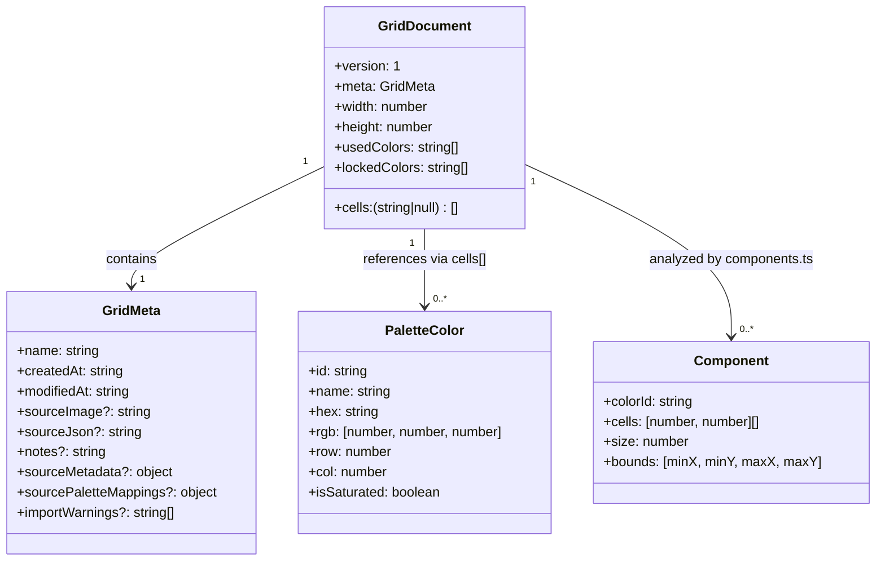

**Critical design decision:** `cells` stores **palette color IDs** (e.g., `"R1C3"`, `"S4"`) — never raw hex values. Cell indexing: `cells[y * width + x]` (row-major, 0-based).

---

## React Component Tree

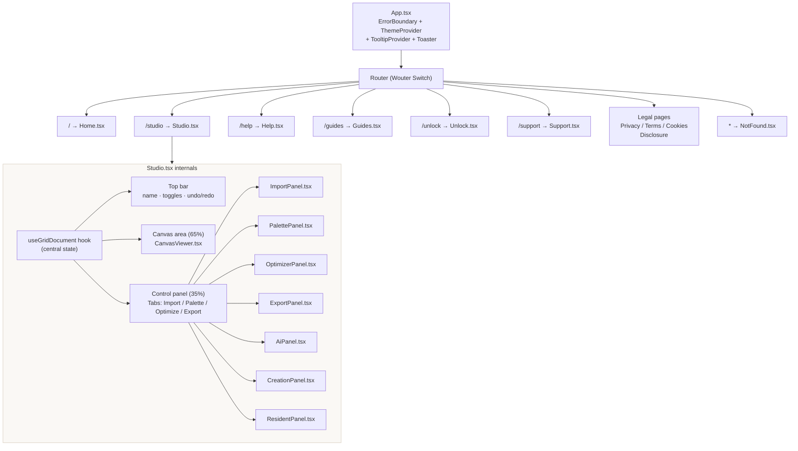

---

## State Management & Data Flow

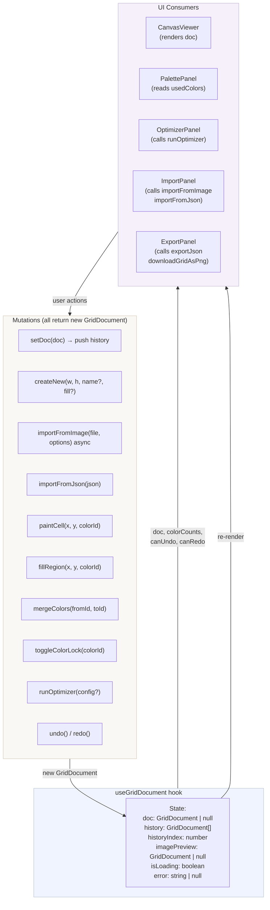

---

## Image Import Pipeline

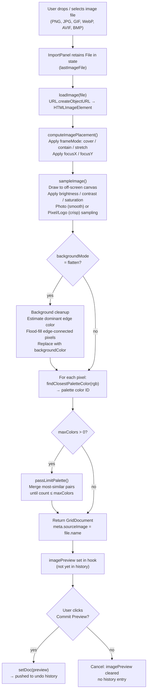

---

## Optimization Pipeline

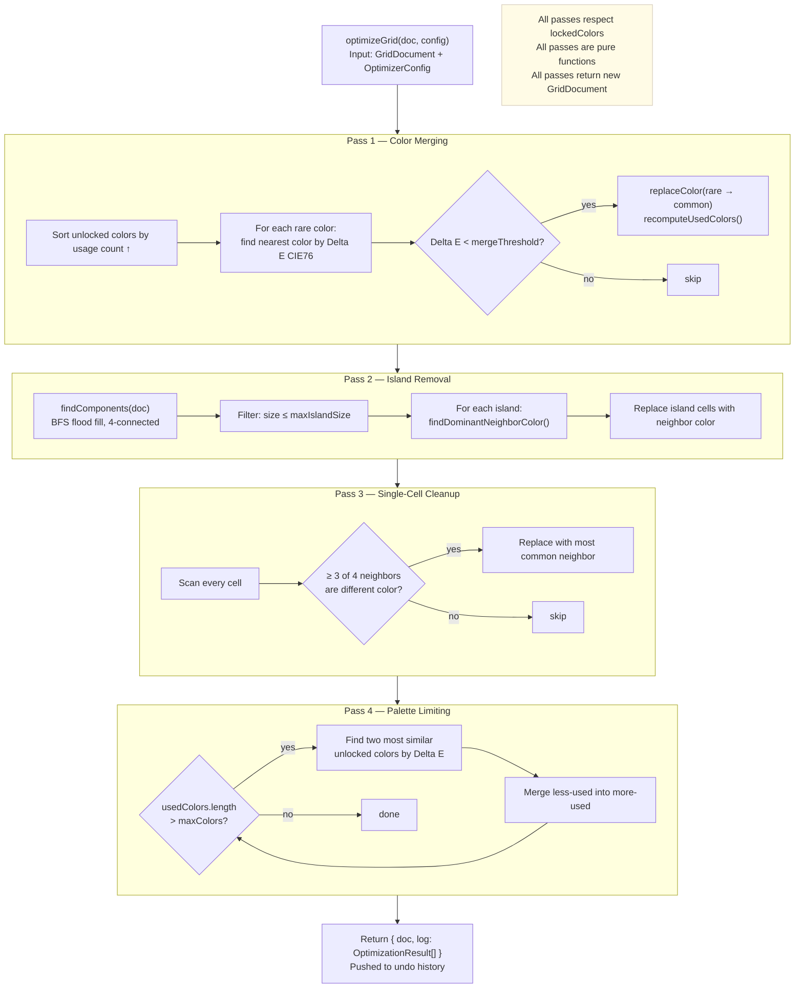

---

## Canvas Rendering Pipeline

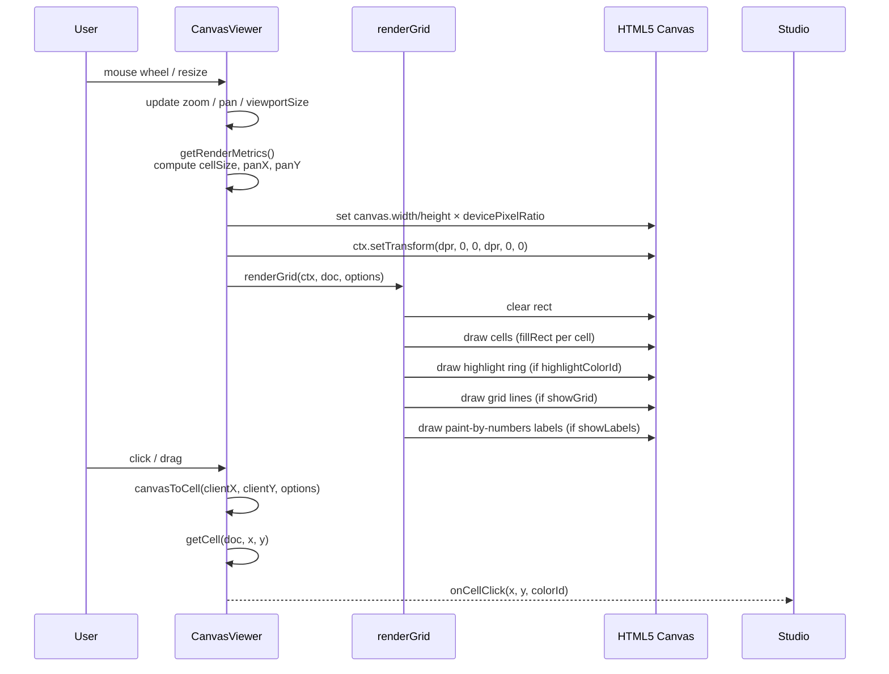

---

## File I/O Model

All file operations use browser-native APIs. **No files ever leave the user's browser.**

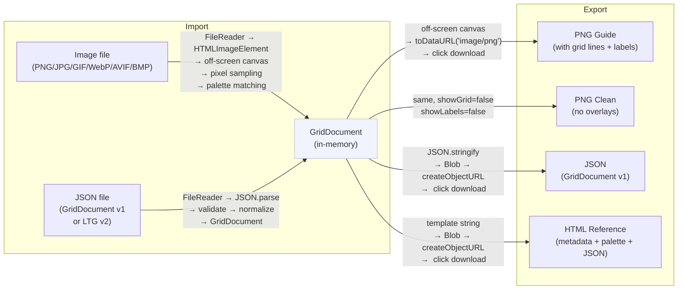

---

## API Routes

The same API logic runs in two environments: the Vite dev server (Express middleware) and Cloudflare Pages Functions (edge).

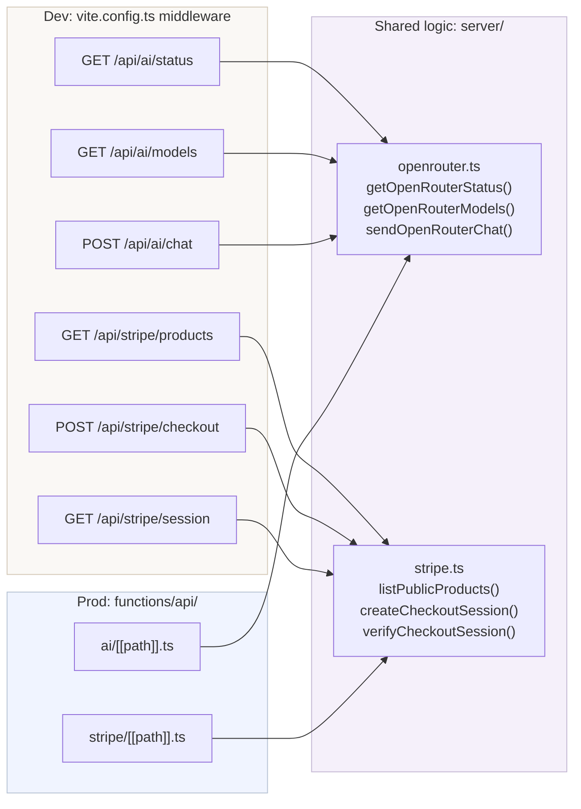

---

## Deployment Architecture

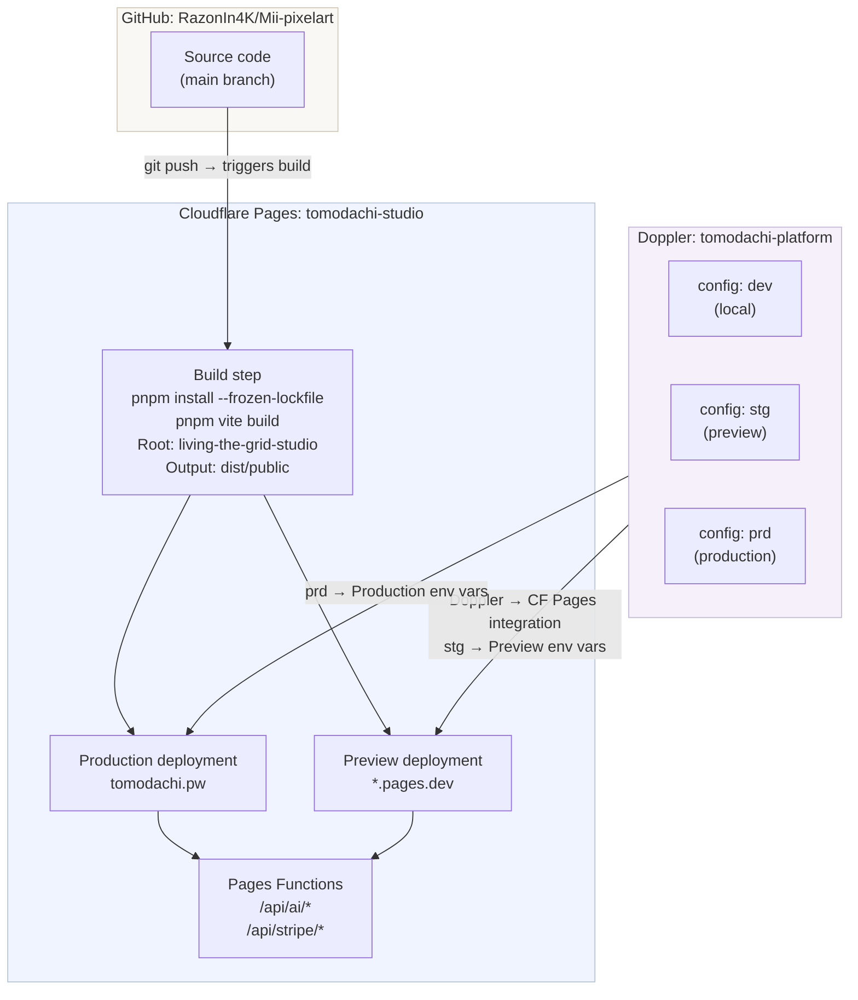

---

## Color Science

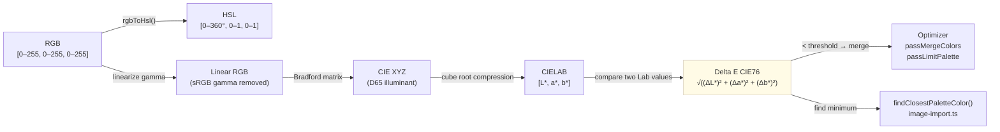

---

## Palette Structure

The game palette has 84 colors organized in a 12-row grid:

```
Rows 1–11: 7 columns each = 77 base colors
Row 12:    7 saturated extras (IDs: S1–S7)

ID format:
  Base colors:      R{row}C{col}   e.g. R1C3 = Row 1, Column 3
  Saturated extras: S{col}         e.g. S4

Row themes:
  R1  Reds        R2  Oranges     R3  Yellows
  R4  Greens      R5  Cyans       R6  Blues
  R7  Purples     R8  Pinks       R9  Browns/Skin tones
  R10 Grays       R11 Warm Grays  R12 Saturated extras
```

---

## Future Considerations

- **Web Workers:** For grids larger than 128×128, optimizer passes could move off the main thread.
- **IndexedDB:** Project auto-save and recovery using browser storage.
- **WASM:** If Delta E calculations become a bottleneck at 256×256, a Rust/WASM module could accelerate the inner loop.
- **Crop rectangle:** Full pan-and-zoom crop controls for image import (Phase 4 remaining).
- **Palette sheet export:** Swatches with labels and IDs as a downloadable image (Phase 5 remaining).
