# Technical Architecture — Living The Grid Repaint Studio

**Version:** 2.3

**Last Updated:** 2026-07-14

> **Deployment status (2026-07-14):** The target architecture on this branch is
> one Cloudflare Worker (Hono) plus Worker Static Assets, D1, private R2, KV,
> Images, and scheduled handlers. Exact source
> `520d0f287d390ba14b0fef179a6394893a5ab92d` is accepted on the isolated
> staging Worker in standard read-only mode. Production `tomodachi.pw` still
> runs the rollback-safe Cloudflare Pages deployment from protected `main`.
> Authenticated writable staging, PR merge, production resources, and Worker
> domain cutover remain independent approval gates. References below to Pages
> Functions describe the active production/rollback compatibility surface, not
> the staging branch runtime. See [ADR 0001](adr/0001-workers-community-platform.md)
> and the [community deployment runbook](community-deployment-runbook.md).

---

## Overview

The studio is a **local-first single-page application** built with React 19 and
TypeScript. Anonymous editing, import, and JSON/PNG/ZIP export stay in the
browser. Account-backed cloud save and community features are explicit opt-ins
served by the unified Worker; authentication alone never uploads or publishes a
local project.

---

## Repository Layout

```
Mii-pixelart/
├── .gitignore
└── living-the-grid-studio/
    ├── client/                    ← React SPA (Vite + TypeScript + Tailwind 4)
    │   ├── index.html
    │   ├── public/                ← Static assets, _headers, _redirects, robots.txt
    │   └── src/
    │       ├── App.tsx            ← Root component + router
    │       ├── main.tsx           ← React DOM entry point
    │       ├── index.css          ← Tailwind + design tokens
    │       ├── components/
    │       │   ├── studio/        ← Studio panel components
    │       │   ├── community/     ← Account, publishing, gallery, and sharing UI
    │       │   └── ui/            ← shadcn/ui primitives
    │       ├── contexts/          ← AuthContext and ThemeContext
    │       ├── hooks/
    │       │   └── useGridDocument.ts  ← Central state hook
    │       ├── lib/
    │       │   └── engine/        ← Pure TS engine (no React deps)
    │       └── pages/             ← Route-level page components
    ├── server/                    ← Shared AI/Stripe helpers retained for parity
    │   ├── openrouter.ts
    │   └── stripe.ts
    ├── functions/                 ← Legacy Pages rollback Functions
    │   └── api/
    ├── worker/                    ← Unified Worker routes, policy, jobs, and documents
    ├── migrations/                ← Forward-only D1 migrations
    ├── shared/                    ← Shared types/constants
    ├── fixtures/                  ← Test fixtures and creative templates
    ├── scripts/                   ← Verification and utility scripts
    ├── package.json
    ├── vite.config.ts
    ├── wrangler.jsonc
    └── doppler.yaml
```

---

## Technology Stack

| Layer | Technology | Rationale |
|-------|-----------|-----------|
| Framework | React 19 + TypeScript | Type safety for complex grid operations |
| Build | Vite 7 + Cloudflare Vite plugin | Fast HMR, SPA assets, and one Worker deploy artifact |
| Styling | Tailwind CSS 4 + shadcn/ui | Utility-first with accessible Radix primitives |
| Routing | Wouter | Lightweight client-side routing |
| State | React hooks (`useState`, `useCallback`) | No external state library needed |
| Canvas | HTML5 Canvas API | Direct pixel rendering for grid display |
| Color Science | Custom CIELAB + Delta E (CIE76) | Perceptual color matching |
| Package manager | pnpm | Required; lockfile committed |
| Target deploy | Cloudflare Worker + Static Assets | One runtime for SPA, APIs, dynamic documents, and scheduled jobs |
| Production rollback | Current protected-`main` Cloudflare Pages deployment | Record the exact immutable URL and source commit at cutover; preserve it through the Worker soak |
| Data | D1 + private R2 + KV + Images | Relational authority, immutable projects/media, bounded cache, generated previews, and normalized optional showcase variants |
| Secrets | Doppler | Runtime injection; no `.env` files committed |

---

## High-Level System Architecture

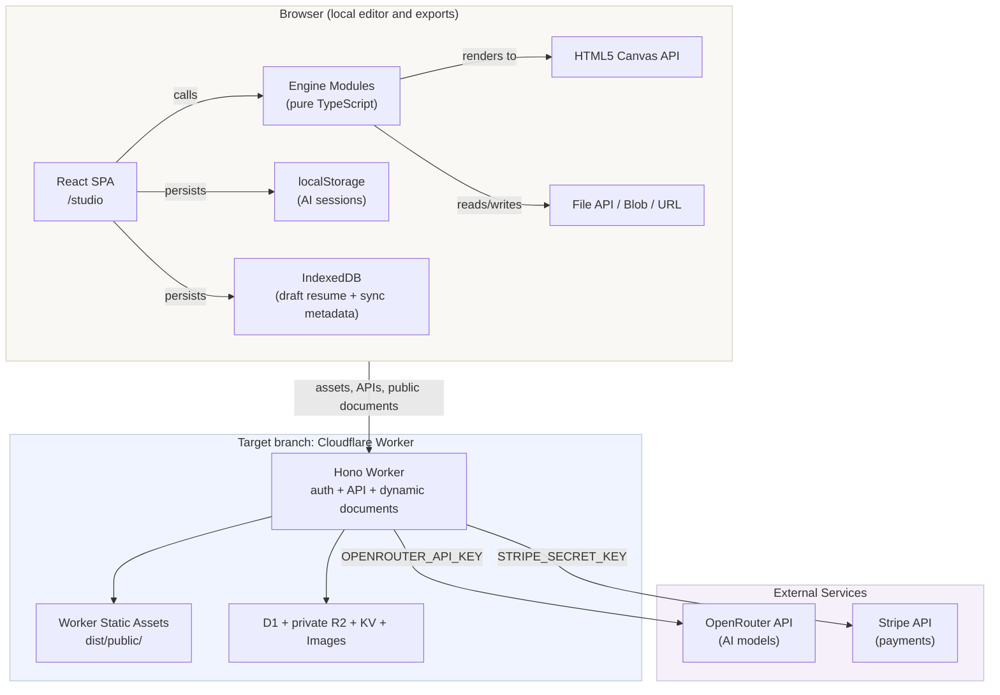
```mermaid
graph TB
    subgraph Browser["Browser (local editor and exports)"]
        SPA["React SPA<br/>/studio"]
        Engine["Engine Modules<br/>(pure TypeScript)"]
        Canvas["HTML5 Canvas API"]
        FileAPI["File API / Blob / URL"]
        LS["localStorage<br/>(AI sessions)"]
        IDB["IndexedDB<br/>(draft resume + sync metadata)"]

        SPA -->|"calls"| Engine
        Engine -->|"renders to"| Canvas
        Engine -->|"reads/writes"| FileAPI
        SPA -->|"persists"| LS
        SPA -->|"persists"| IDB
    end

    subgraph Edge["Target branch: Cloudflare Worker"]
        Worker["Hono Worker<br/>auth + API + dynamic documents"]
        Static["Worker Static Assets<br/>dist/public/"]
        Data["D1 + private R2 + KV + Images"]
        Worker --> Static
        Worker --> Data
    end

    subgraph External["External Services"]
        OR["OpenRouter API<br/>(AI models)"]
        Stripe["Stripe API<br/>(payments)"]
    end

    Browser -->|"assets, APIs, public documents"| Worker
    Worker -->|"OPENROUTER_API_KEY"| OR
    Worker -->|"STRIPE_SECRET_KEY"| Stripe

    style Browser fill:#faf8f5,stroke:#d4c9b8
    style Edge fill:#f0f4ff,stroke:#b8c4d4
    style External fill:#f5f0fa,stroke:#c4b8d4
```

---

## Engine Module Architecture

All engine modules are **pure TypeScript with zero React dependencies**. They can be tested and used outside the UI.

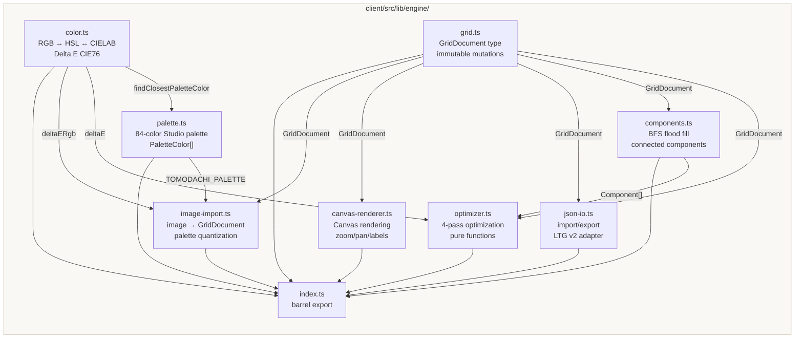
```mermaid
graph LR
    subgraph Engine["client/src/lib/engine/"]
        palette["palette.ts<br/>84-color Studio palette<br/>PaletteColor[]"]
        color["color.ts<br/>RGB ↔ HSL ↔ CIELAB<br/>Delta E CIE76"]
        grid["grid.ts<br/>GridDocument type<br/>immutable mutations"]
        components["components.ts<br/>BFS flood fill<br/>connected components"]
        optimizer["optimizer.ts<br/>4-pass optimization<br/>pure functions"]
        json_io["json-io.ts<br/>import/export<br/>LTG v2 adapter"]
        canvas_renderer["canvas-renderer.ts<br/>Canvas rendering<br/>zoom/pan/labels"]
        image_import["image-import.ts<br/>image → GridDocument<br/>palette quantization"]
        barrel["index.ts<br/>barrel export"]
    end

    color -->|"findClosestPaletteColor"| palette
    grid -->|"GridDocument"| optimizer
    grid -->|"GridDocument"| components
    components -->|"Component[]"| optimizer
    color -->|"deltaE"| optimizer
    grid -->|"GridDocument"| json_io
    grid -->|"GridDocument"| canvas_renderer
    grid -->|"GridDocument"| image_import
    color -->|"deltaERgb"| image_import
    palette -->|"TOMODACHI_PALETTE"| image_import

    palette --> barrel
    color --> barrel
    grid --> barrel
    components --> barrel
    optimizer --> barrel
    json_io --> barrel
    canvas_renderer --> barrel
    image_import --> barrel

    style Engine fill:#faf8f5,stroke:#d4c9b8
```

---

## Data Model

The central data structure is the **`GridDocument`** — a fully serializable representation of a pixel grid project.

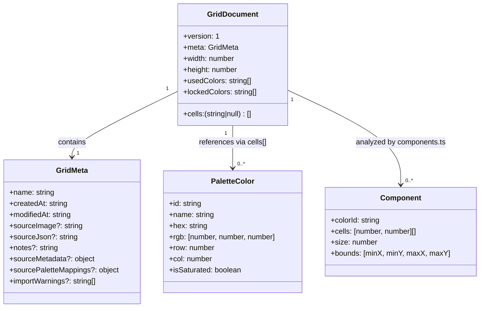
```mermaid
classDiagram
    class GridDocument {
        +version: 1
        +meta: GridMeta
        +width: number
        +height: number
        +cells: (string|null)[]
        +usedColors: string[]
        +lockedColors: string[]
    }

    class GridMeta {
        +name: string
        +createdAt: string
        +modifiedAt: string
        +sourceImage?: string
        +sourceJson?: string
        +notes?: string
        +sourceMetadata?: object
        +sourcePaletteMappings?: object
        +importWarnings?: string[]
    }

    class PaletteColor {
        +id: string
        +name: string
        +hex: string
        +rgb: [number, number, number]
        +row: number
        +col: number
        +isSaturated: boolean
    }

    class Component {
        +colorId: string
        +cells: [number, number][]
        +size: number
        +bounds: [minX, minY, maxX, maxY]
    }

    GridDocument "1" --> "1" GridMeta : contains
    GridDocument "1" --> "0..*" PaletteColor : references via cells[]
    GridDocument "1" --> "0..*" Component : analyzed by components.ts
```

**Critical design decision:** `cells` stores **palette color IDs** (e.g., `"R1C3"`, `"S4"`) — never raw hex values. Cell indexing: `cells[y * width + x]` (row-major, 0-based).

---

## React Component Tree

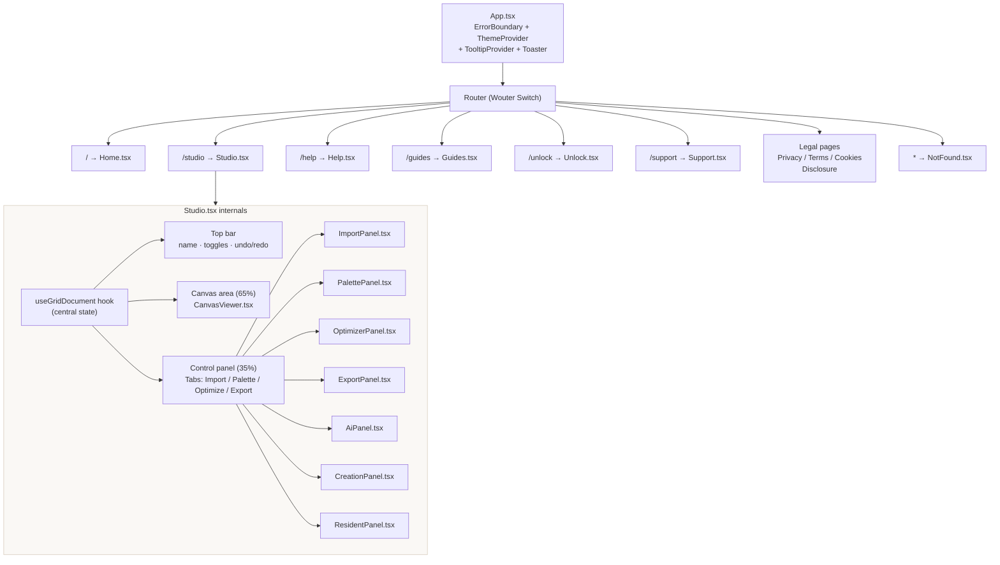
```mermaid
graph TD
    App["App.tsx<br/>ErrorBoundary + ThemeProvider<br/>+ TooltipProvider + Toaster"]
    Router["Router (Wouter Switch)"]

    Home["/  →  Home.tsx"]
    Studio["/studio  →  Studio.tsx"]
    Help["/help  →  Help.tsx"]
    Guides["/guides  →  Guides.tsx"]
    Unlock["/unlock  →  Unlock.tsx"]
    Support["/support  →  Support.tsx"]
    Legal["Legal pages<br/>Privacy / Terms / Cookies<br/>Disclosure"]
    NotFound["* → NotFound.tsx"]

    App --> Router
    Router --> Home
    Router --> Studio
    Router --> Help
    Router --> Guides
    Router --> Unlock
    Router --> Support
    Router --> Legal
    Router --> NotFound

    subgraph StudioTree["Studio.tsx internals"]
        Hook["useGridDocument hook<br/>(central state)"]
        TopBar["Top bar<br/>name · toggles · undo/redo"]
        CanvasArea["Canvas area (65%)<br/>CanvasViewer.tsx"]
        SidePanel["Control panel (35%)<br/>Tabs: Import / Palette / Optimize / Export"]

        ImportPanel["ImportPanel.tsx"]
        PalettePanel["PalettePanel.tsx"]
        OptimizerPanel["OptimizerPanel.tsx"]
        ExportPanel["ExportPanel.tsx"]
        AiPanel["AiPanel.tsx"]
        CreationPanel["CreationPanel.tsx"]
        ResidentPanel["ResidentPanel.tsx"]

        Hook --> TopBar
        Hook --> CanvasArea
        Hook --> SidePanel
        SidePanel --> ImportPanel
        SidePanel --> PalettePanel
        SidePanel --> OptimizerPanel
        SidePanel --> ExportPanel
        SidePanel --> AiPanel
        SidePanel --> CreationPanel
        SidePanel --> ResidentPanel
    end

    Studio --> StudioTree

    style StudioTree fill:#faf8f5,stroke:#d4c9b8
```

---

## State Management & Data Flow

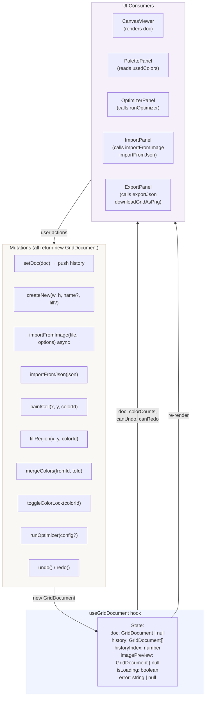
```mermaid
flowchart TD
    subgraph Hook["useGridDocument hook"]
        State["State:\ndoc: GridDocument | null\nhistory: GridDocument[]\nhistoryIndex: number\nimagePreview: GridDocument | null\nisLoading: boolean\nerror: string | null"]
    end

    subgraph Actions["Mutations (all return new GridDocument)"]
        setDoc["setDoc(doc) → push history"]
        createNew["createNew(w, h, name?, fill?)"]
        importImage["importFromImage(file, options) async"]
        importJson["importFromJson(json)"]
        paintCell["paintCell(x, y, colorId)"]
        fillRegion["fillRegion(x, y, colorId)"]
        mergeColors["mergeColors(fromId, toId)"]
        toggleLock["toggleColorLock(colorId)"]
        runOptimizer["runOptimizer(config?)"]
        undo["undo() / redo()"]
    end

    subgraph Consumers["UI Consumers"]
        CV["CanvasViewer\n(renders doc)"]
        PP["PalettePanel\n(reads usedColors)"]
        OP["OptimizerPanel\n(calls runOptimizer)"]
        IP["ImportPanel\n(calls importFromImage\nimportFromJson)"]
        EP["ExportPanel\n(calls exportJson\ndownloadGridAsPng)"]
    end

    Hook -->|"doc, colorCounts,\ncanUndo, canRedo"| Consumers
    Consumers -->|"user actions"| Actions
    Actions -->|"new GridDocument"| State
    State -->|"re-render"| Consumers

    style Hook fill:#f0f4ff,stroke:#b8c4d4
    style Actions fill:#faf8f5,stroke:#d4c9b8
    style Consumers fill:#f5f0fa,stroke:#c4b8d4
```

---

## Image Import Pipeline

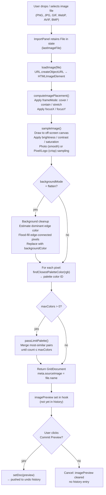
```mermaid
flowchart TD
    A["User drops / selects image file\n(PNG, JPG, GIF, WebP, AVIF, BMP)"]
    B["ImportPanel retains File in state\n(lastImageFile)"]
    C["loadImage(file)\nURL.createObjectURL → HTMLImageElement"]
    D["computeImagePlacement()\nApply frameMode: cover / contain / stretch\nApply focusX / focusY"]
    E["sampleImage()\nDraw to off-screen canvas\nApply brightness / contrast / saturation\nPhoto (smooth) or Pixel/Logo (crisp) sampling"]
    F{"backgroundMode\n= flatten?"}
    G["Background cleanup\nEstimate dominant edge color\nFlood-fill edge-connected pixels\nReplace with backgroundColor"]
    H["For each pixel:\nfindClosestPaletteColor(rgb)\n→ palette color ID"]
    I{"maxColors > 0?"}
    J["passLimitPalette()\nMerge most-similar pairs\nuntil count ≤ maxColors"]
    K["Return GridDocument\nmeta.sourceImage = file.name"]
    L["imagePreview set in hook\n(not yet in history)"]
    M{"User clicks\nCommit Preview?"}
    N["setDoc(preview)\n→ pushed to undo history"]
    O["Cancel: imagePreview cleared\nno history entry"]

    A --> B --> C --> D --> E --> F
    F -->|"yes"| G --> H
    F -->|"no"| H
    H --> I
    I -->|"yes"| J --> K
    I -->|"no"| K
    K --> L --> M
    M -->|"yes"| N
    M -->|"no"| O
```

---

## Optimization Pipeline

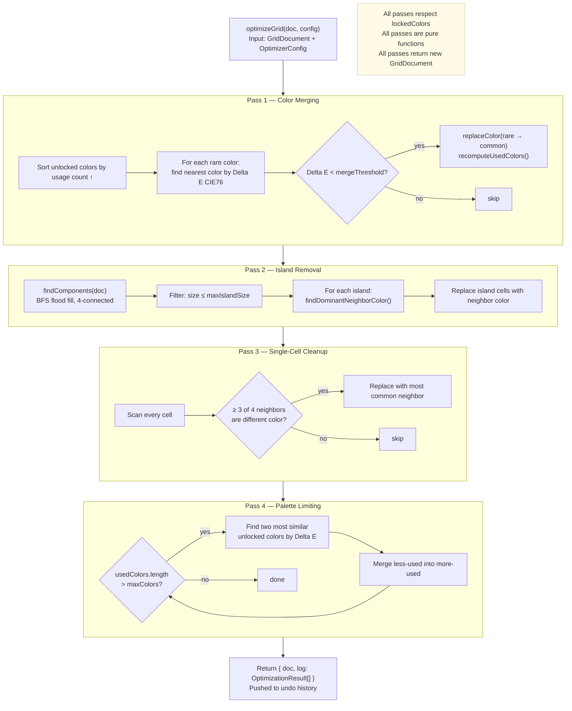
```mermaid
flowchart TD
    Start["optimizeGrid(doc, config)\nInput: GridDocument + OptimizerConfig"]

    subgraph Pass1["Pass 1 — Color Merging"]
        P1A["Sort unlocked colors by usage count ↑"]
        P1B["For each rare color:\nfind nearest color by Delta E CIE76"]
        P1C{"Delta E < mergeThreshold?"}
        P1D["replaceColor(rare → common)\nrecomputeUsedColors()"]
        P1A --> P1B --> P1C
        P1C -->|"yes"| P1D
        P1C -->|"no"| P1E["skip"]
    end

    subgraph Pass2["Pass 2 — Island Removal"]
        P2A["findComponents(doc)\nBFS flood fill, 4-connected"]
        P2B["Filter: size ≤ maxIslandSize"]
        P2C["For each island:\nfindDominantNeighborColor()"]
        P2D["Replace island cells with neighbor color"]
        P2A --> P2B --> P2C --> P2D
    end

    subgraph Pass3["Pass 3 — Single-Cell Cleanup"]
        P3A["Scan every cell"]
        P3B{"≥ 3 of 4 neighbors\nare different color?"}
        P3C["Replace with most common neighbor"]
        P3A --> P3B
        P3B -->|"yes"| P3C
        P3B -->|"no"| P3D["skip"]
    end

    subgraph Pass4["Pass 4 — Palette Limiting"]
        P4A{"usedColors.length\n> maxColors?"}
        P4B["Find two most similar\nunlocked colors by Delta E"]
        P4C["Merge less-used into more-used"]
        P4A -->|"yes"| P4B --> P4C --> P4A
        P4A -->|"no"| P4E["done"]
    end

    End["Return { doc, log: OptimizationResult[] }\nPushed to undo history"]

    Start --> Pass1 --> Pass2 --> Pass3 --> Pass4 --> End

    note1["All passes respect lockedColors\nAll passes are pure functions\nAll passes return new GridDocument"]
    style note1 fill:#fffbe6,stroke:#d4c9b8
```

---

## Canvas Rendering Pipeline

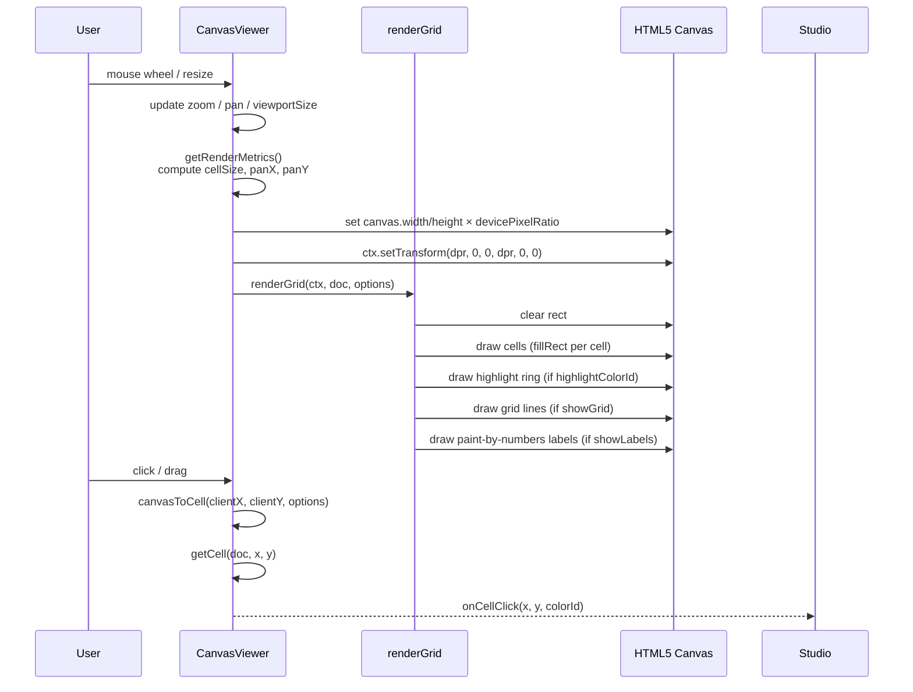
```mermaid
sequenceDiagram
    participant User
    participant CanvasViewer
    participant renderGrid
    participant Canvas as HTML5 Canvas

    User->>CanvasViewer: mouse wheel / resize
    CanvasViewer->>CanvasViewer: update zoom / pan / viewportSize
    CanvasViewer->>CanvasViewer: getRenderMetrics()<br/>compute cellSize, panX, panY
    CanvasViewer->>Canvas: set canvas.width/height × devicePixelRatio
    CanvasViewer->>Canvas: ctx.setTransform(dpr, 0, 0, dpr, 0, 0)
    CanvasViewer->>renderGrid: renderGrid(ctx, doc, options)
    renderGrid->>Canvas: clear rect
    renderGrid->>Canvas: draw cells (fillRect per cell)
    renderGrid->>Canvas: draw highlight ring (if highlightColorId)
    renderGrid->>Canvas: draw grid lines (if showGrid)
    renderGrid->>Canvas: draw paint-by-numbers labels (if showLabels)

    User->>CanvasViewer: click / drag
    CanvasViewer->>CanvasViewer: canvasToCell(clientX, clientY, options)
    CanvasViewer->>CanvasViewer: getCell(doc, x, y)
    CanvasViewer-->>Studio: onCellClick(x, y, colorId)
```

---

## File I/O Model

Anonymous file operations use browser-native APIs. **No project leaves the
browser unless the user explicitly chooses the first private cloud save.**

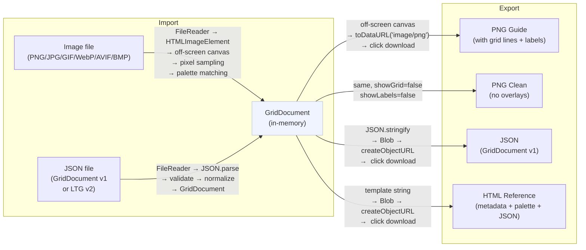
```mermaid
flowchart LR
    subgraph Import
        I1["Image file\n(PNG/JPG/GIF/WebP/AVIF/BMP)"]
        I2["JSON file\n(GridDocument v1\nor LTG v2)"]
        I1 -->|"FileReader → HTMLImageElement\n→ off-screen canvas\n→ pixel sampling\n→ palette matching"| GD
        I2 -->|"FileReader → JSON.parse\n→ validate → normalize\n→ GridDocument"| GD
    end

    GD["GridDocument\n(in-memory)"]

    subgraph Export
        E1["PNG Guide\n(with grid lines + labels)"]
        E2["PNG Clean\n(no overlays)"]
        E3["JSON\n(GridDocument v1)"]
        E4["HTML Reference\n(metadata + palette + JSON)"]
        GD -->|"off-screen canvas\n→ toDataURL('image/png')\n→ <a> click download"| E1
        GD -->|"same, showGrid=false\nshowLabels=false"| E2
        GD -->|"JSON.stringify\n→ Blob → createObjectURL\n→ <a> click download"| E3
        GD -->|"template string\n→ Blob → createObjectURL\n→ <a> click download"| E4
    end

    style GD fill:#f0f4ff,stroke:#b8c4d4
```

---

## API Routes

The branch runs local development and deployed requests through the same Worker
entry point. Existing AI, Stripe, webhook, and crawler behavior is ported into
that Worker; the old Express/Pages paths remain only as compatibility and
rollback references.

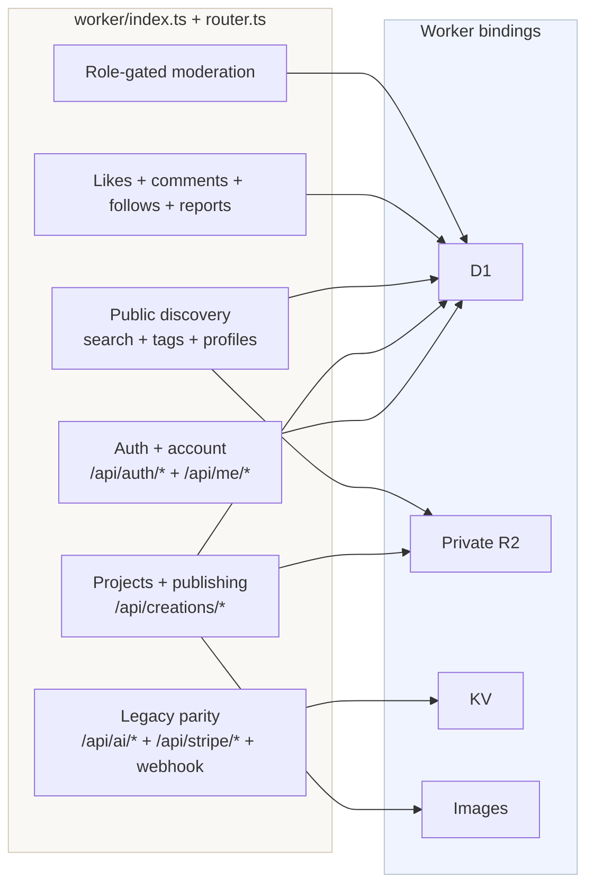
```mermaid
graph LR
    subgraph Runtime["worker/index.ts + router.ts"]
        Legacy["Legacy parity<br/>/api/ai/* + /api/stripe/* + webhook"]
        Auth["Auth + account<br/>/api/auth/* + /api/me/*"]
        Creations["Projects + publishing<br/>/api/creations/*"]
        Discovery["Public discovery<br/>search + tags + profiles"]
        Social["Likes + comments + follows + reports"]
        Moderation["Role-gated moderation"]
    end

    subgraph Bindings["Worker bindings"]
        DB["D1"]
        Objects["Private R2"]
        Cache["KV"]
        Images["Images"]
    end

    Legacy --> Cache
    Auth & Creations & Discovery & Social & Moderation --> DB
    Creations & Discovery --> Objects
    Creations --> Images

    style Runtime fill:#faf8f5,stroke:#d4c9b8
    style Bindings fill:#f0f4ff,stroke:#b8c4d4
```

---

## Deployment Architecture

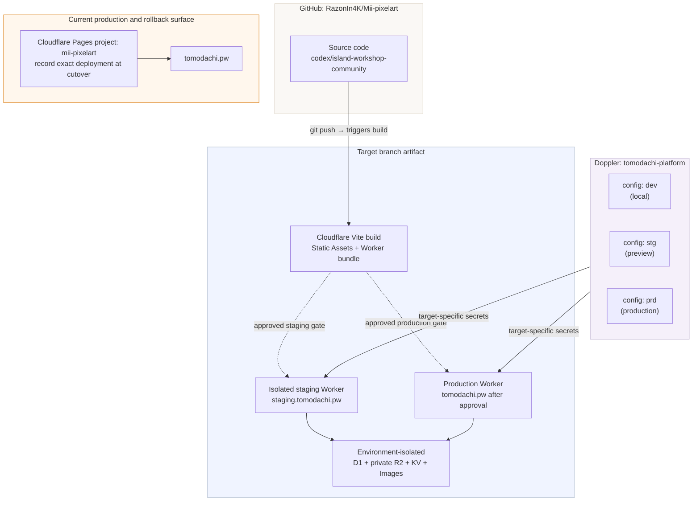
```mermaid
graph TB
    subgraph Repo["GitHub: RazonIn4K/Mii-pixelart"]
        Code["Source code\ncodex/island-workshop-community"]
    end

    subgraph Doppler["Doppler: tomodachi-platform"]
        Dev_cfg["config: dev\n(local)"]
        Stg_cfg["config: stg\n(preview)"]
        Prd_cfg["config: prd\n(production)"]
    end

    subgraph Target["Target branch artifact"]
        Build["Cloudflare Vite build\nStatic Assets + Worker bundle"]
        Staging["Isolated staging Worker\nstaging.tomodachi.pw"]
        ProductionWorker["Production Worker\ntomodachi.pw after approval"]
        Bindings["Environment-isolated\nD1 + private R2 + KV + Images"]
    end

    subgraph Rollback["Current production and rollback surface"]
        Pages["Cloudflare Pages project: mii-pixelart\nrecord exact deployment at cutover"]
        Production["tomodachi.pw"]
    end

    Code -->|"git push → triggers build"| Build
    Build -.->|"approved staging gate"| Staging
    Build -.->|"approved production gate"| ProductionWorker
    Doppler -->|"target-specific secrets"| Staging
    Doppler -->|"target-specific secrets"| ProductionWorker
    Staging & ProductionWorker --> Bindings
    Pages --> Production

    style Repo fill:#faf8f5,stroke:#d4c9b8
    style Doppler fill:#f5f0fa,stroke:#c4b8d4
    style Target fill:#f0f4ff,stroke:#b8c4d4
    style Rollback fill:#fff7ed,stroke:#d97706
```

Worker provisioning, migration, deployment, domain cutover, and rollback are
approval-gated. The operational source of truth is the
[community deployment runbook](community-deployment-runbook.md); do not infer
authorization from this diagram.

---

## Color Science

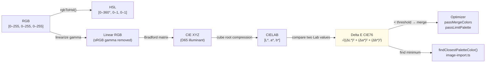
```mermaid
flowchart LR
    RGB["RGB\n[0–255, 0–255, 0–255]"]
    HSL["HSL\n[0–360°, 0–1, 0–1]"]
    Linear["Linear RGB\n(sRGB gamma removed)"]
    XYZ["CIE XYZ\n(D65 illuminant)"]
    Lab["CIELAB\n[L*, a*, b*]"]
    DeltaE["Delta E CIE76\n√((ΔL*)² + (Δa*)² + (Δb*)²)"]

    RGB -->|"rgbToHsl()"| HSL
    RGB -->|"linearize gamma"| Linear
    Linear -->|"Bradford matrix"| XYZ
    XYZ -->|"cube root compression"| Lab
    Lab -->|"compare two Lab values"| DeltaE

    DeltaE -->|"< threshold → merge"| Optimizer["Optimizer\npassMergeColors\npassLimitPalette"]
    DeltaE -->|"find minimum"| Matcher["findClosestPaletteColor()\nimage-import.ts"]

    style DeltaE fill:#fffbe6,stroke:#d4c9b8
```

---

## Palette Structure

The Studio working palette has 84 colors organized in a 12-row grid. It is a consistent planning convention, not verified proprietary game-palette data:

```
Rows 1–11: 7 columns each = 77 base colors
Row 12:    7 saturated extras (IDs: S1–S7)

ID format:
  Base colors:      R{row}C{col}   e.g. R1C3 = Row 1, Column 3
  Saturated extras: S{col}         e.g. S4

Row themes:
  R1  Reds        R2  Oranges     R3  Yellows
  R4  Greens      R5  Cyans       R6  Blues
  R7  Purples     R8  Pinks       R9  Browns/Skin tones
  R10 Grays       R11 Warm Grays  R12 Saturated extras
```

---

## Future Considerations

- **Web Workers:** For grids larger than 128×128, optimizer passes could move off the main thread.
- **WASM:** If Delta E calculations become a bottleneck at 256×256, a Rust/WASM module could accelerate the inner loop.
- **Crop refinement:** Add finer pan-and-zoom controls inside the implemented draggable crop rectangle if user testing warrants them.
- **Optimizer explanation:** Add per-pass previews, change summaries, and a repaintability score without changing deterministic output.
- **AI history:** Keep chat browser-local unless a later privacy review approves explicit opt-in cloud sync.
