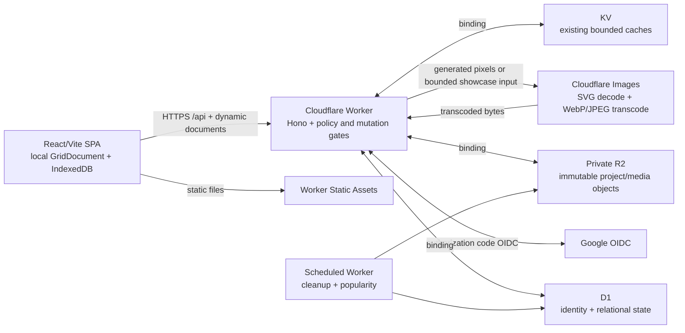
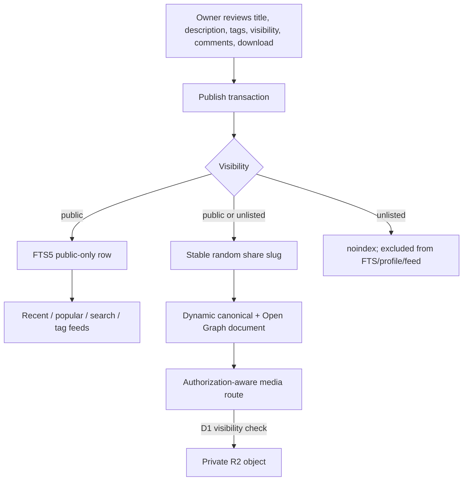

# Community platform data flow

This document complements
[`ADR 0001`](adr/0001-workers-community-platform.md) and the
[`showcase-image decision`](adr/0002-creation-showcase-images.md), plus the
[`threat model`](community-threat-model.md). D1 is authoritative for identity,
ownership, visibility, and object manifests. R2 never decides access.

## System boundaries



## Anonymous and sign-in flow

```mermaid
sequenceDiagram
  participant B as Browser
  participant I as IndexedDB
  participant W as Worker
  participant G as Google OIDC
  participant D as D1

  B->>B: Edit/import/export locally
  Note over B,W: No network project write occurs
  B->>I: Store resume draft before sign-in
  B->>W: POST /api/auth/google/start {returnTo}
  W-->>B: Authorization URL + encrypted transaction cookie
  B->>G: Navigate with state, nonce, S256 challenge
  G-->>W: GET callback with authorization code + state
  W->>G: Exchange code and validate ID token
  W->>D: Upsert provider subject; create hashed session
  W-->>B: Set Secure HttpOnly session; 303 validated returnTo
  B->>I: Recover resume draft
  Note over B,D: Sign-in does not save or publish the draft
```

The OAuth transaction cookie contains only state, nonce, PKCE verifier,
validated relative return path, and expiry. Google tokens are discarded after
validation. D1 stores the provider `sub`, verified email, and only the SHA-256
hash of the application session token.

## First save and autosave saga

```mermaid
sequenceDiagram
  participant B as Browser
  participant W as Worker
  participant D as D1
  participant R as Private R2
  participant X as Images

  B->>W: POST /api/creations (explicit opt-in; canonical project)
  W->>W: Mutation gate, authenticate, Origin check, Zod validation
  W->>W: Strip source filenames/arbitrary metadata; recompute colors
  W->>D: Atomically reserve quota + private creation + uploading revision
  W->>R: PUT immutable project.json
  W->>X: Transcode deterministic grid-only SVG
  X-->>W: WebP thumbnail/preview + JPEG social image
  W->>R: PUT immutable generated media
  W->>D: batch(manifests ready, revision ready, current pointer, bytes)
  W-->>B: 201 private creation + ETag revision

  B->>B: Wait 1.5 s after a later edit
  B->>W: PUT project with If-Match
  alt current revision matches
    W->>D: Reserve next revision
    W->>R: PUT immutable objects
    W->>D: Batch commit and obsolete prior revision
    W-->>B: 200 + new ETag
  else stale revision
    W-->>B: 409 REVISION_CONFLICT + current revision
  end
```

If any R2 write or transformation fails, the Worker marks the revision failed
and schedules best-effort object deletion. If the final D1 batch fails, the
objects are not reachable and are removed immediately or by the hourly stale
upload job. The current pointer only references a `ready` revision.

## Publish, discover, and media flow



Unpublish, hide, delete, or public-to-unlisted changes delete the FTS row in the
same D1 batch as the visibility change. Public media may use immutable caching;
private media is `Cache-Control: private, no-store`. Project JSON is downloadable
by the owner, or by a viewer only when the published creation explicitly enables
downloads.

## Optional showcase-image flow

```mermaid
sequenceDiagram
  participant B as Owner browser
  participant W as Worker
  participant D as D1
  participant X as Images
  participant R as Private R2

  B->>W: POST image ticket JSON with cookie
  W->>W: Authenticate owner, exact Origin, limits and quota
  W->>D: Store hash of ten-minute one-use ticket
  W-->>B: Bearer ticket + same-origin upload URL
  B->>W: PUT raw bytes (credentials omit, Bearer ticket)
  W->>D: Atomically consume ticket and reserve image slot
  W->>X: Decode, inspect, resize; animation disabled
  X-->>W: display.webp + thumb.webp + social.jpg
  W->>R: PUT generated variants under generated keys
  W->>D: Commit ready manifest, sizes, order, cover
  W-->>B: Normalized image record and gallery
  Note over W,R: Raw bytes, filename, and metadata are never persisted
```

The showcase gallery is optional and belongs to an existing grid creation. It
does not upload the Studio import source automatically and does not create an
image-only post. Public, unlisted, and private reads always derive access from
the parent creation in D1. A failed Images/R2/D1 step cleans generated objects
without changing the current project revision.

## Reports, moderation, and deletion

```mermaid
sequenceDiagram
  participant U as Signed-in user
  participant W as Worker
  participant D as D1
  participant M as Moderator
  participant C as Scheduled cleanup
  participant R as Private R2

  U->>W: POST /api/reports
  W->>D: Enforce daily limit + one open duplicate
  M->>W: Review queue and submit reasoned action
  W->>D: Role check + state mutation + append audit action
  C->>D: Purge resolved free text after 90 days

  U->>W: DELETE /api/me with fresh session
  W->>D: deletion_pending, private visibility, revoke all sessions
  Note over U,D: Seven-day cancellation window
  C->>D: Select due account and manifested object keys
  C->>R: Delete every manifested object idempotently
  C->>D: Delete user; cascade owned/social content
  C->>D: Retain only pseudonymized moderation metadata until two years
```

## Storage invariants

- Object keys are generated, immutable, and never include usernames, titles,
  filenames, or arbitrary user paths:
  `private/creations/{creationId}/{revisionId}/{kind.ext}`.
- `creation_objects` records kind, key, content type, byte size, SHA-256, and
  state for every R2 object.
- `creation_showcase_images` records decoded dimensions, plain-text alt text,
  order, cover, ticket state, and lifecycle state. `creation_showcase_objects`
  records each generated variant key, hash, content type, and byte size. Raw
  source objects do not exist.
- A user may own at most 100 creations and 50 MiB across all manifested cloud
  objects; a single canonical project JSON is at most 2 MiB.
- The Worker streams account NDJSON export records and never buffers the full
  account quota.
- Generated avatars derive from `avatar_seed` and the original Island Workshop
  palette. Profile-image uploads remain unsupported. Optional showcase images
  are explicit attachments to an existing cloud creation, not avatar or
  general-purpose file uploads.
